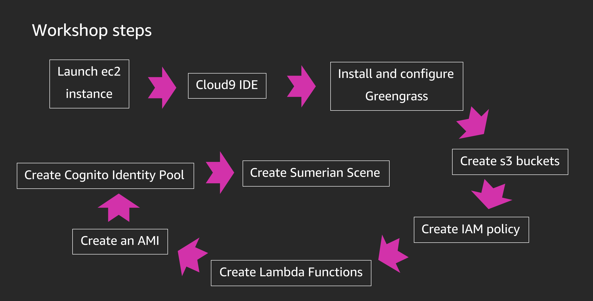
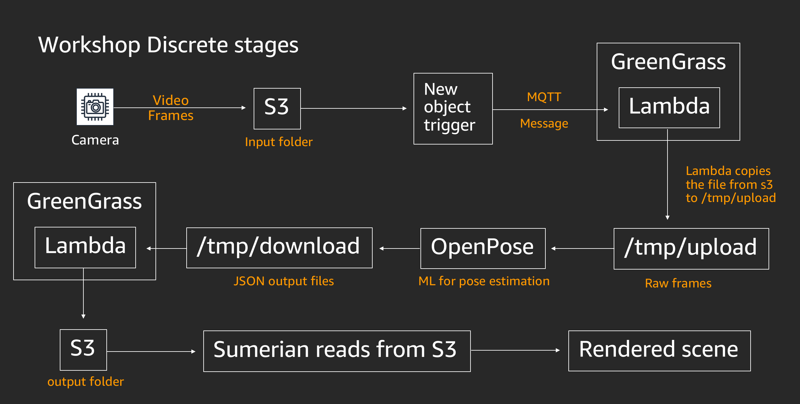

# Workshop - Module 01 

## 1. Getting Started

### 1.1 General flow of the workshop
1. Here is a flowchart showing the high level steps from a camera to Amazon Sumerian: 

	

1. Here is the workshop architecture:

	

## 1.2 Navigation

To get started you will first login to the Workshop. The workshop will create an AWS account, a development environment, and the associated infrastructure to complete the workshop.

1. Use your browser to navigate to [https://portal.awsworkshop.io](https://portal.awsworkshop.io)

1. Use your **email address** and your **unique token** to login to the Workshop

1. Once you are logged in, please move on to module 02

**Note**: *You should have received a piece of paper with a hash token on it. If not, please request one from one of the lab assistants.*

## Legal Notice

By engaging in this workshop, you acknowledge that the AWS account used for AWS Snowball Edge and AWS Greengrass for Fun and Profit - STG388, may be used only for this workshop. All accounts used during the workshop will be closed immediately at the conclusion of the workshop. Any content in this AWS account will not be retrievable by you or any other workshop participants after the workshop has finished.
