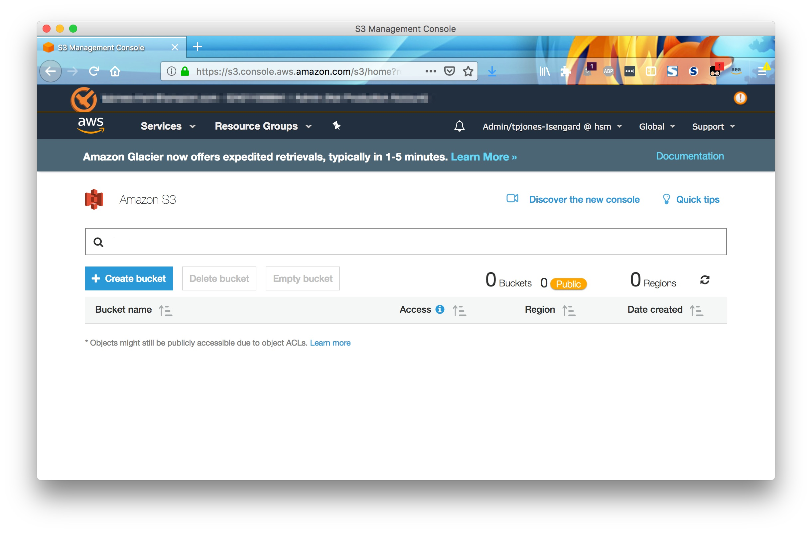
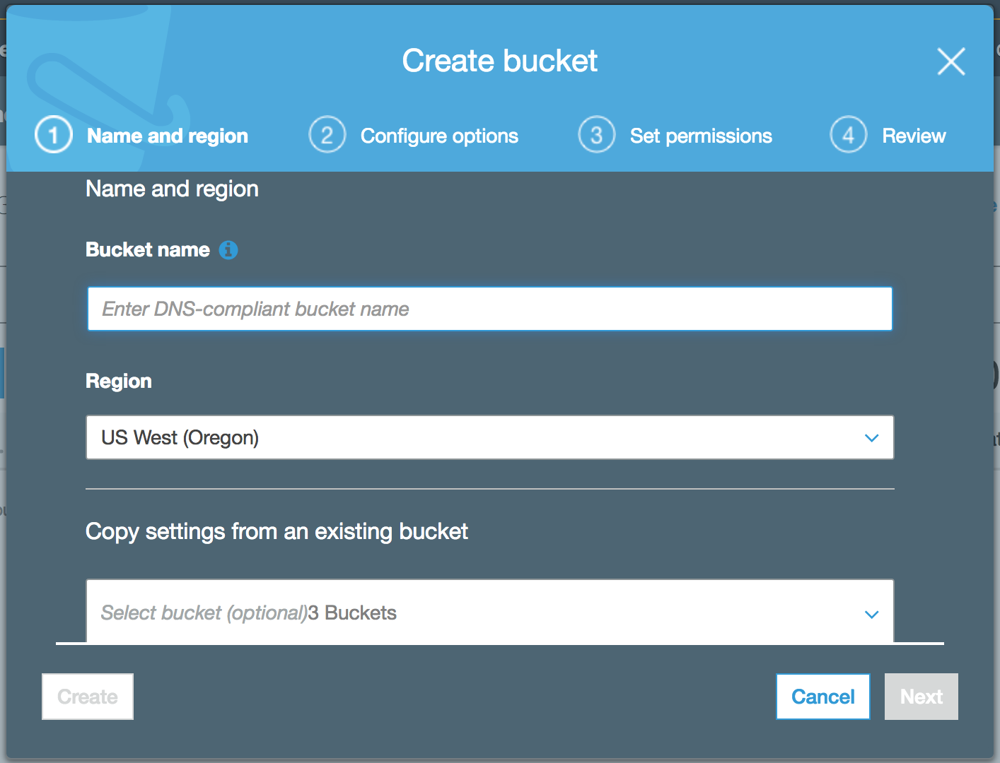

# Workshop
## 1. Getting Started
To get started you will first login to the Workshop. The workshop will create an AWS account, a development environment, and the associated infrastructure to complete the workshop.

1. Use your browser to navigate to https://edge.awsworkshop.io

2. Use your email address and your unique token to login to the Workshop

   Note: You should have received a piece of paper with a hash token on it. If not, please request one from one of the lab assistants.

## 2. Storage
### 2.1 Creating a S3 Bucket

1. Login to the [AWS Management Console](https://console.aws.amazon.com)
2. Navigate to the **s3** service console
3. Select **Create Bucket**

4. name your bucket something unique (like: 2018_SBE_bucket_<yourname><random number>)
5. 

5. create folders for "openpose_input", "openpose_output"
6. <insert photo of completed folders/prefix>
7. End of this section

