# Workshop
## 1. AMI Creation

### 1.1 Launching a new instance

1. Login to the [AWS Management Console](https://console.aws.amazon.com)

1. Navigate to EC2 service console

1. Select to **Launch instance**

  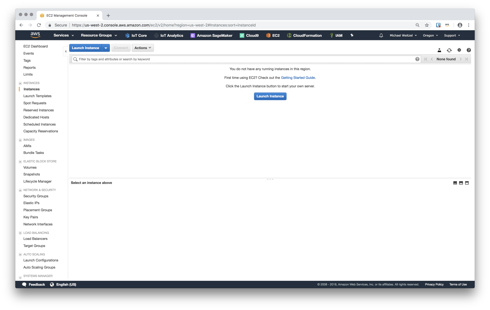

1. **Select** to launch `Ubuntu Server 16.04 LTS (HVM), SSD Volume Type` from the list

  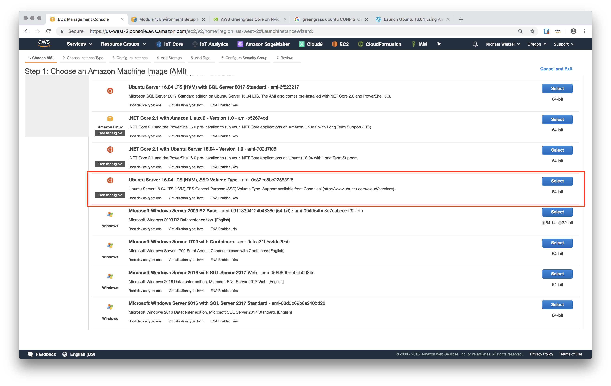

1. Select the `p3.2xlarge` instance type and click **Configure Instance Details** 

1. Choose your network, the subnet should populate automatically (there is only one), and enable Auto-assign Public IP. Click **Add Storage**

1. Click **Add Tags**

1. Click **Configure Security Group** 

1. Add a `Custom TCP` rule to the instance's security group by selecting to **Add Rule**

   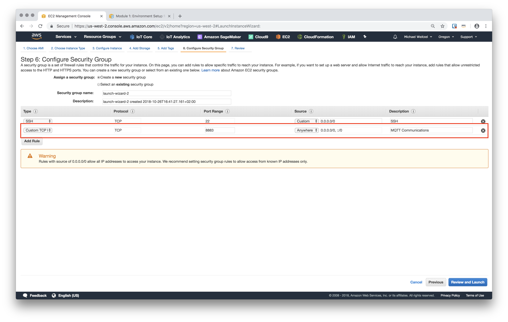
   **NB**: The configuration should be as follows:

   * *Type*: `Custom TCP`
   * *Protocol*: `TCP`
   * *Port Range*: `8883`
   * *Source*: `Anywhere`
   * *Description*: `MQTT Communications`

1. Review the selected configuration and confirm by pressing the **Launch** button
	
	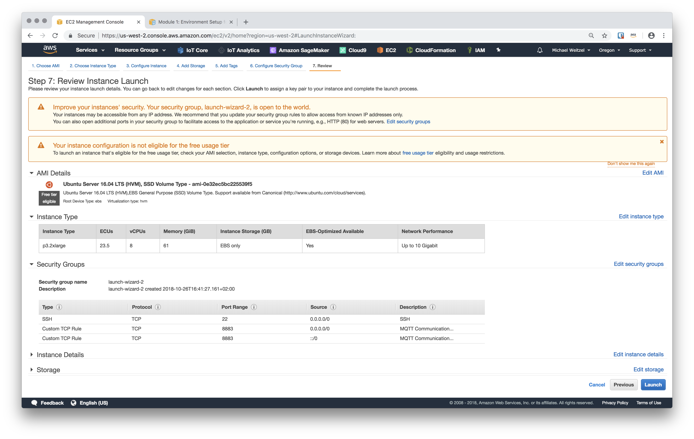

1. Create a new keypair, call it `SBE_Workshop` and download the private key, select to **Launch Instance**
	
	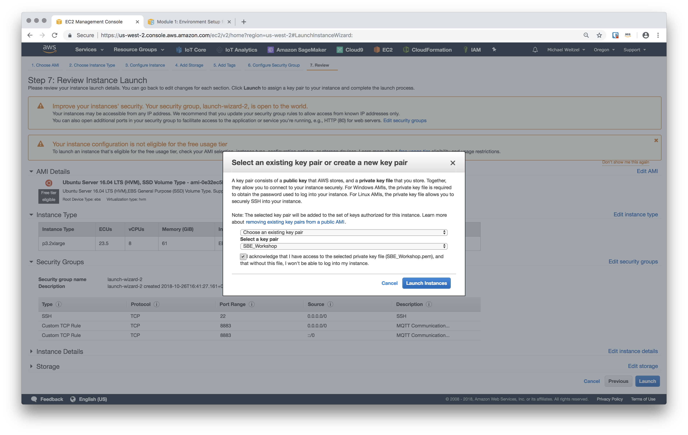

1. Once you have created the instance and downloaded the private key click to **View Instances** to confirm that everything is running fine
	
	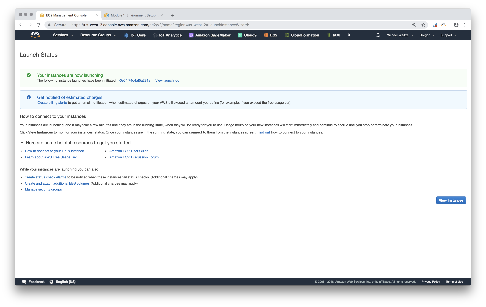

### 1.2 Connecting to the new instance from your computer

1. On your computer make sure that the private key you downloaded has the correct permissions set
	
	Command: `chmod 600 ~/Downloads/SBE_Workshop.pem`
	
	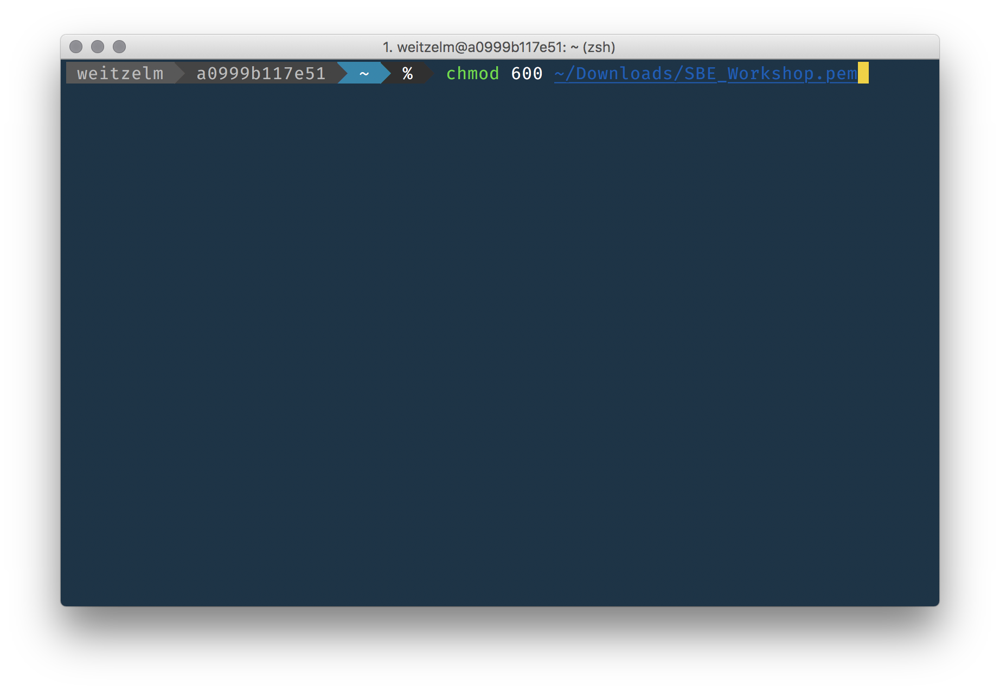
1. Look up the connection information for your instance in the EC2 console
	
	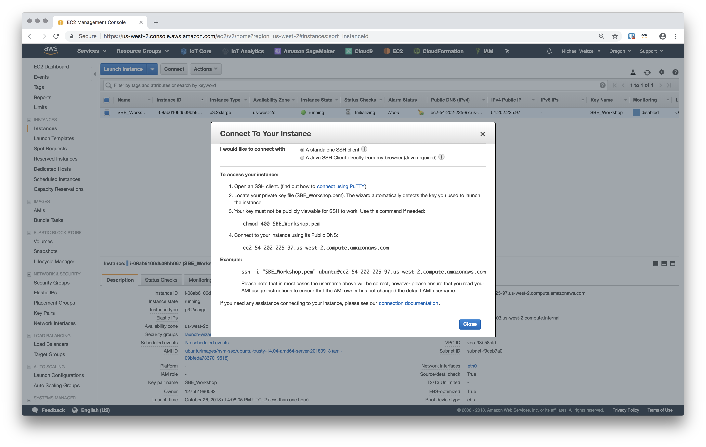
1. Use the connection information to create an SSH session to your running instance

  <details>
  	<summary>Command: `ssh -i "~/Downloads/SBE_Workshop.pem" ubuntu@ec2-34-222-222-74.us-west-2.compute.amazonaws.com`</summary>

  	Output:
  	
  	The authenticity of host 'ec2-34-222-222-74.us-west-2.compute.amazonaws.com (34.222.222.74)' can't be established.
  	ECDSA key fingerprint is SHA256:JyJwNbtJYB4GPJCQHZCnxsdtKIv4cKM596uum8TFhBY.
  	Are you sure you want to continue connecting (yes/no)? yes
  	Warning: Permanently added 'ec2-34-222-222-74.us-west-2.compute.amazonaws.com,34.222.222.74' (ECDSA) to the list of known hosts.
  	Welcome to Ubuntu 16.04.5 LTS (GNU/Linux 4.4.0-1067-aws x86_64)
  	
  	 * Documentation:  https://help.ubuntu.com
  	 * Management:     https://landscape.canonical.com
  	 * Support:        https://ubuntu.com/advantage
  	
  	  Get cloud support with Ubuntu Advantage Cloud Guest:
  	    http://www.ubuntu.com/business/services/cloud
  	
  	0 packages can be updated.
  	0 updates are security updates.

  ​	
  ​	
  	The programs included with the Ubuntu system are free software;
  	the exact distribution terms for each program are described in the
  	individual files in /usr/share/doc/*/copyright.
  	
  	Ubuntu comes with ABSOLUTELY NO WARRANTY, to the extent permitted by
  	applicable law.
  	
  	To run a command as administrator (user "root"), use "sudo <command>".
  	See "man sudo_root" for details.
  </details>

  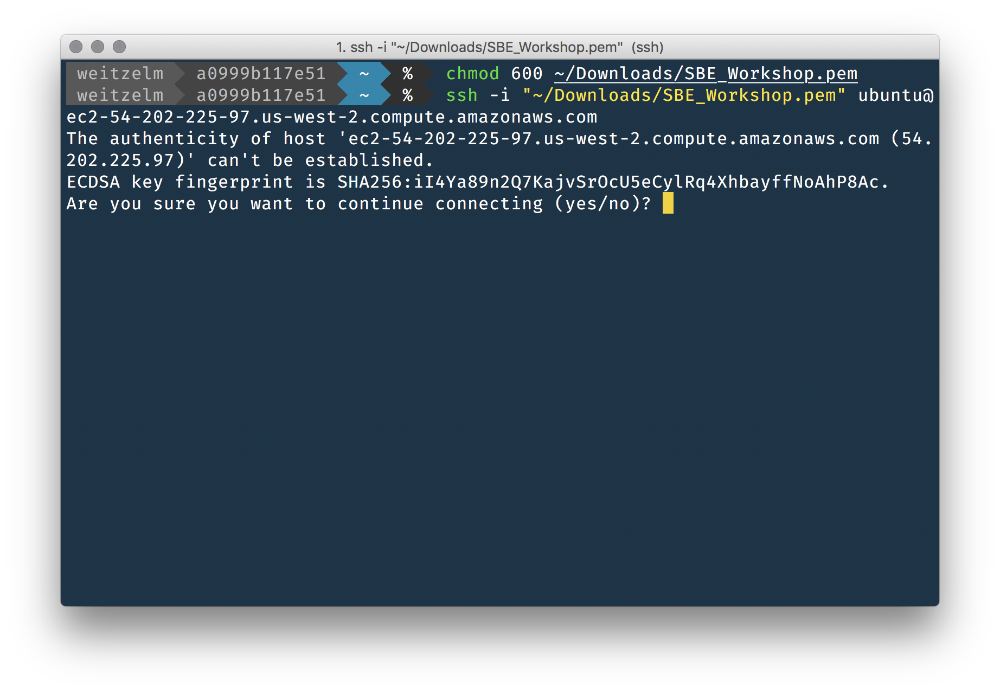
  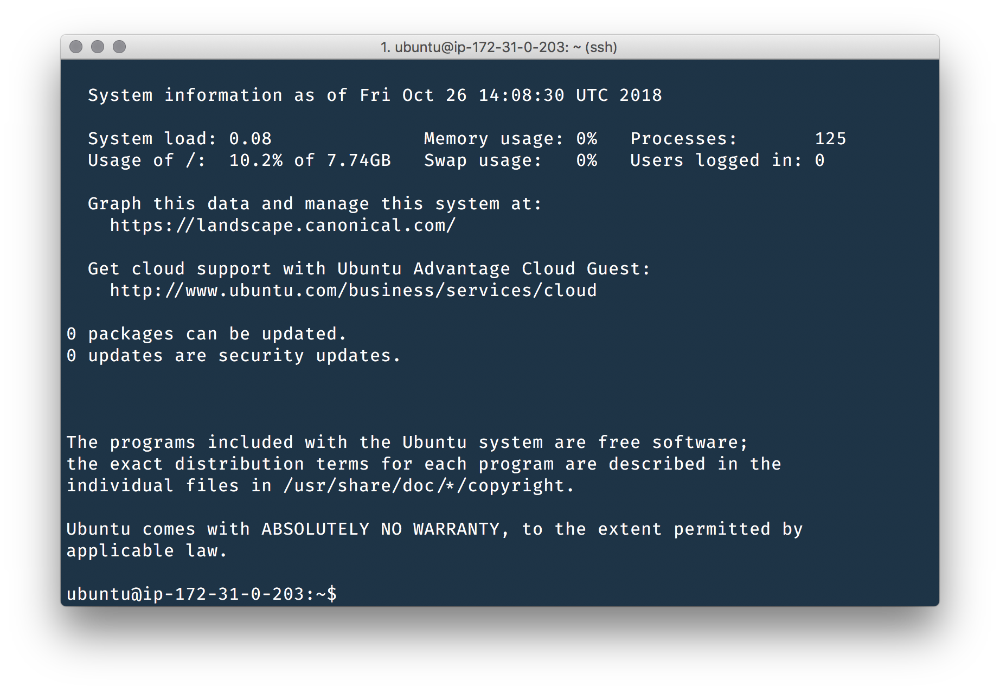
1. <details>
		<summary>Command: `sudo apt-get update`</summary>

		Output:
		
		```
		Hit:1 http://us-west-2.ec2.archive.ubuntu.com/ubuntu xenial InRelease
		Get:2 http://us-west-2.ec2.archive.ubuntu.com/ubuntu xenial-updates InRelease [109 kB]
		Get:3 http://us-west-2.ec2.archive.ubuntu.com/ubuntu xenial-backports InRelease [107 kB]
		Get:4 http://us-west-2.ec2.archive.ubuntu.com/ubuntu xenial/main Sources [868 kB]
		Get:5 http://us-west-2.ec2.archive.ubuntu.com/ubuntu xenial/restricted Sources [4,808 B]
		Get:6 http://us-west-2.ec2.archive.ubuntu.com/ubuntu xenial/universe Sources [7,728 kB]
		Get:7 http://security.ubuntu.com/ubuntu xenial-security InRelease [107 kB]
		Get:8 http://us-west-2.ec2.archive.ubuntu.com/ubuntu xenial/multiverse Sources [179 kB]
		Get:9 http://us-west-2.ec2.archive.ubuntu.com/ubuntu xenial/universe amd64 Packages [7,532 kB]
		Get:10 http://us-west-2.ec2.archive.ubuntu.com/ubuntu xenial/universe Translation-en [4,354 kB]
		Get:11 http://security.ubuntu.com/ubuntu xenial-security/main Sources [136 kB]
		Get:12 http://us-west-2.ec2.archive.ubuntu.com/ubuntu xenial/multiverse amd64 Packages [144 kB]
		Get:13 http://us-west-2.ec2.archive.ubuntu.com/ubuntu xenial/multiverse Translation-en [106 kB]
		Get:14 http://us-west-2.ec2.archive.ubuntu.com/ubuntu xenial-updates/main Sources [323 kB]
		Get:15 http://us-west-2.ec2.archive.ubuntu.com/ubuntu xenial-updates/restricted Sources [2,528 B]
		Get:16 http://us-west-2.ec2.archive.ubuntu.com/ubuntu xenial-updates/universe Sources [225 kB]
		Get:17 http://us-west-2.ec2.archive.ubuntu.com/ubuntu xenial-updates/multiverse Sources [8,384 B]
		Get:18 http://us-west-2.ec2.archive.ubuntu.com/ubuntu xenial-updates/main amd64 Packages [869 kB]
		Get:19 http://us-west-2.ec2.archive.ubuntu.com/ubuntu xenial-updates/main Translation-en [353 kB]
		Get:20 http://us-west-2.ec2.archive.ubuntu.com/ubuntu xenial-updates/universe amd64 Packages [697 kB]
		Get:21 http://us-west-2.ec2.archive.ubuntu.com/ubuntu xenial-updates/universe Translation-en [282 kB]
		Get:22 http://us-west-2.ec2.archive.ubuntu.com/ubuntu xenial-updates/multiverse amd64 Packages [16.4 kB]
		Get:23 http://us-west-2.ec2.archive.ubuntu.com/ubuntu xenial-updates/multiverse Translation-en [8,344 B]
		Get:24 http://us-west-2.ec2.archive.ubuntu.com/ubuntu xenial-backports/main Sources [4,868 B]
		Get:25 http://us-west-2.ec2.archive.ubuntu.com/ubuntu xenial-backports/universe Sources [6,740 B]
		Get:26 http://us-west-2.ec2.archive.ubuntu.com/ubuntu xenial-backports/main amd64 Packages [7,304 B]
		Get:27 http://us-west-2.ec2.archive.ubuntu.com/ubuntu xenial-backports/main Translation-en [4,456 B]
		Get:28 http://us-west-2.ec2.archive.ubuntu.com/ubuntu xenial-backports/universe amd64 Packages [7,804 B]
		Get:29 http://us-west-2.ec2.archive.ubuntu.com/ubuntu xenial-backports/universe Translation-en [4,184 B]
		Get:30 http://security.ubuntu.com/ubuntu xenial-security/restricted Sources [2,116 B]
		Get:31 http://security.ubuntu.com/ubuntu xenial-security/universe Sources [78.8 kB]
		Get:32 http://security.ubuntu.com/ubuntu xenial-security/multiverse Sources [2,088 B]
		Get:33 http://security.ubuntu.com/ubuntu xenial-security/main amd64 Packages [573 kB]
		Get:34 http://security.ubuntu.com/ubuntu xenial-security/main Translation-en [240 kB]
		Get:35 http://security.ubuntu.com/ubuntu xenial-security/universe amd64 Packages [393 kB]
		Get:36 http://security.ubuntu.com/ubuntu xenial-security/universe Translation-en [151 kB]
		Get:37 http://security.ubuntu.com/ubuntu xenial-security/multiverse amd64 Packages [3,460 B]
		Get:38 http://security.ubuntu.com/ubuntu xenial-security/multiverse Translation-en [1,744 B]
		Fetched 25.6 MB in 4s (5,986 kB/s)
		Reading package lists... Done
	<details>

1. <details>
		<summary>Command: `sudo apt-get upgrade -y`</summary>

		Output:
		
		Reading package lists... Done
		Building dependency tree
		Reading state information... Done
		Calculating upgrade... Done
		The following packages have been kept back:
		  linux-aws linux-headers-aws linux-image-aws
		The following packages will be upgraded:
		  apparmor apt apt-transport-https apt-utils bind9-host
		  cloud-initramfs-copymods cloud-initramfs-dyn-netconf curl dnsutils git
		  git-man initramfs-tools initramfs-tools-bin initramfs-tools-core
		  libapparmor-perl libapparmor1 libapt-inst2.0 libapt-pkg5.0 libbind9-140
		  libcurl3-gnutls libdns-export162 libdns162 libglib2.0-0 libglib2.0-data
		  libisc-export160 libisc160 libisccc140 libisccfg140 liblwres141
		  libpam-systemd libsystemd0 libudev1 open-iscsi openssh-client openssh-server
		  openssh-sftp-server overlayroot python3-requests python3-update-manager
		  systemd systemd-sysv tzdata udev update-manager-core
		44 upgraded, 0 newly installed, 0 to remove and 3 not upgraded.
		Need to get 16.4 MB of archives.
		After this operation, 24.6 kB of additional disk space will be used.
		Get:1 http://us-west-2.ec2.archive.ubuntu.com/ubuntu xenial-updates/main amd64 libapt-pkg5.0 amd64 1.2.29 [707 kB]
		Get:2 http://us-west-2.ec2.archive.ubuntu.com/ubuntu xenial-updates/main amd64 libapt-inst2.0 amd64 1.2.29 [55.5 kB]
		Get:3 http://us-west-2.ec2.archive.ubuntu.com/ubuntu xenial-updates/main amd64 apt amd64 1.2.29 [1,041 kB]
		Get:4 http://us-west-2.ec2.archive.ubuntu.com/ubuntu xenial-updates/main amd64 apt-utils amd64 1.2.29 [196 kB]
		Get:5 http://us-west-2.ec2.archive.ubuntu.com/ubuntu xenial-updates/main amd64 libsystemd0 amd64 229-4ubuntu21.5 [204 kB]
		Get:6 http://us-west-2.ec2.archive.ubuntu.com/ubuntu xenial-updates/main amd64 libpam-systemd amd64 229-4ubuntu21.5 [115 kB]
		Get:7 http://us-west-2.ec2.archive.ubuntu.com/ubuntu xenial-updates/main amd64 systemd amd64 229-4ubuntu21.5 [3,635 kB]
		Get:8 http://us-west-2.ec2.archive.ubuntu.com/ubuntu xenial-updates/main amd64 udev amd64 229-4ubuntu21.5 [993 kB]
		Get:9 http://us-west-2.ec2.archive.ubuntu.com/ubuntu xenial-updates/main amd64 libudev1 amd64 229-4ubuntu21.5 [54.2 kB]
		Get:10 http://us-west-2.ec2.archive.ubuntu.com/ubuntu xenial-updates/main amd64 initramfs-tools all 0.122ubuntu8.13 [8,936 B]
		Get:11 http://us-west-2.ec2.archive.ubuntu.com/ubuntu xenial-updates/main amd64 initramfs-tools-core all 0.122ubuntu8.13 [44.7 kB]
		Get:12 http://us-west-2.ec2.archive.ubuntu.com/ubuntu xenial-updates/main amd64 initramfs-tools-bin amd64 0.122ubuntu8.13 [9,742 B]
		Get:13 http://us-west-2.ec2.archive.ubuntu.com/ubuntu xenial-updates/main amd64 systemd-sysv amd64 229-4ubuntu21.5 [11.7 kB]
		Get:14 http://us-west-2.ec2.archive.ubuntu.com/ubuntu xenial-updates/main amd64 libapparmor1 amd64 2.10.95-0ubuntu2.10 [29.7 kB]
		Get:15 http://us-west-2.ec2.archive.ubuntu.com/ubuntu xenial-updates/main amd64 libglib2.0-0 amd64 2.48.2-0ubuntu4.1 [1,120 kB]
		Get:16 http://us-west-2.ec2.archive.ubuntu.com/ubuntu xenial-updates/main amd64 open-iscsi amd64 2.0.873+git0.3b4b4500-14ubuntu3.6 [334 kB]
		Get:17 http://us-west-2.ec2.archive.ubuntu.com/ubuntu xenial-updates/main amd64 tzdata all 2018f-0ubuntu0.16.04 [166 kB]
		Get:18 http://us-west-2.ec2.archive.ubuntu.com/ubuntu xenial-updates/main amd64 libisc-export160 amd64 1:9.10.3.dfsg.P4-8ubuntu1.11 [153 kB]
		Get:19 http://us-west-2.ec2.archive.ubuntu.com/ubuntu xenial-updates/main amd64 libdns-export162 amd64 1:9.10.3.dfsg.P4-8ubuntu1.11 [667 kB]
		Get:20 http://us-west-2.ec2.archive.ubuntu.com/ubuntu xenial-updates/main amd64 libapparmor-perl amd64 2.10.95-0ubuntu2.10 [31.6 kB]
		Get:21 http://us-west-2.ec2.archive.ubuntu.com/ubuntu xenial-updates/main amd64 apparmor amd64 2.10.95-0ubuntu2.10 [451 kB]
		Get:22 http://us-west-2.ec2.archive.ubuntu.com/ubuntu xenial-updates/main amd64 curl amd64 7.47.0-1ubuntu2.9 [138 kB]
		Get:23 http://us-west-2.ec2.archive.ubuntu.com/ubuntu xenial-updates/main amd64 libcurl3-gnutls amd64 7.47.0-1ubuntu2.9 [184 kB]
		Get:24 http://us-west-2.ec2.archive.ubuntu.com/ubuntu xenial-updates/main amd64 apt-transport-https amd64 1.2.29 [26.2 kB]
		Get:25 http://us-west-2.ec2.archive.ubuntu.com/ubuntu xenial-updates/main amd64 bind9-host amd64 1:9.10.3.dfsg.P4-8ubuntu1.11 [38.4 kB]
		Get:26 http://us-west-2.ec2.archive.ubuntu.com/ubuntu xenial-updates/main amd64 dnsutils amd64 1:9.10.3.dfsg.P4-8ubuntu1.11 [89.2 kB]
		Get:27 http://us-west-2.ec2.archive.ubuntu.com/ubuntu xenial-updates/main amd64 libisc160 amd64 1:9.10.3.dfsg.P4-8ubuntu1.11 [215 kB]
		Get:28 http://us-west-2.ec2.archive.ubuntu.com/ubuntu xenial-updates/main amd64 libdns162 amd64 1:9.10.3.dfsg.P4-8ubuntu1.11 [881 kB]
		Get:29 http://us-west-2.ec2.archive.ubuntu.com/ubuntu xenial-updates/main amd64 libisccc140 amd64 1:9.10.3.dfsg.P4-8ubuntu1.11 [16.3 kB]
		Get:30 http://us-west-2.ec2.archive.ubuntu.com/ubuntu xenial-updates/main amd64 libisccfg140 amd64 1:9.10.3.dfsg.P4-8ubuntu1.11 [40.4 kB]
		Get:31 http://us-west-2.ec2.archive.ubuntu.com/ubuntu xenial-updates/main amd64 liblwres141 amd64 1:9.10.3.dfsg.P4-8ubuntu1.11 [33.7 kB]
		Get:32 http://us-west-2.ec2.archive.ubuntu.com/ubuntu xenial-updates/main amd64 libbind9-140 amd64 1:9.10.3.dfsg.P4-8ubuntu1.11 [23.6 kB]
		Get:33 http://us-west-2.ec2.archive.ubuntu.com/ubuntu xenial-updates/main amd64 libglib2.0-data all 2.48.2-0ubuntu4.1 [132 kB]
		Get:34 http://us-west-2.ec2.archive.ubuntu.com/ubuntu xenial-updates/main amd64 openssh-sftp-server amd64 1:7.2p2-4ubuntu2.5 [38.6 kB]
		Get:35 http://us-west-2.ec2.archive.ubuntu.com/ubuntu xenial-updates/main amd64 openssh-server amd64 1:7.2p2-4ubuntu2.5 [335 kB]
		Get:36 http://us-west-2.ec2.archive.ubuntu.com/ubuntu xenial-updates/main amd64 openssh-client amd64 1:7.2p2-4ubuntu2.5 [588 kB]
		Get:37 http://us-west-2.ec2.archive.ubuntu.com/ubuntu xenial-updates/main amd64 python3-update-manager all 1:16.04.14 [33.1 kB]
		Get:38 http://us-west-2.ec2.archive.ubuntu.com/ubuntu xenial-updates/main amd64 update-manager-core all 1:16.04.14 [5,504 B]
		Get:39 http://us-west-2.ec2.archive.ubuntu.com/ubuntu xenial-updates/main amd64 git-man all 1:2.7.4-0ubuntu1.5 [736 kB]
		Get:40 http://us-west-2.ec2.archive.ubuntu.com/ubuntu xenial-updates/main amd64 git amd64 1:2.7.4-0ubuntu1.5 [2,714 kB]
		Get:41 http://us-west-2.ec2.archive.ubuntu.com/ubuntu xenial-updates/main amd64 python3-requests all 2.9.1-3ubuntu0.1 [55.8 kB]
		Get:42 http://us-west-2.ec2.archive.ubuntu.com/ubuntu xenial-updates/main amd64 cloud-initramfs-copymods all 0.27ubuntu1.6 [4,380 B]
		Get:43 http://us-west-2.ec2.archive.ubuntu.com/ubuntu xenial-updates/main amd64 cloud-initramfs-dyn-netconf all 0.27ubuntu1.6 [6,892 B]
		Get:44 http://us-west-2.ec2.archive.ubuntu.com/ubuntu xenial-updates/main amd64 overlayroot all 0.27ubuntu1.6 [15.7 kB]
		Fetched 16.4 MB in 0s (41.4 MB/s)
		Extracting templates from packages: 100%
		Preconfiguring packages ...
		(Reading database ... 51284 files and directories currently installed.)
		Preparing to unpack .../libapt-pkg5.0_1.2.29_amd64.deb ...
		Unpacking libapt-pkg5.0:amd64 (1.2.29) over (1.2.27) ...
		Processing triggers for libc-bin (2.23-0ubuntu10) ...
		Setting up libapt-pkg5.0:amd64 (1.2.29) ...
		Processing triggers for libc-bin (2.23-0ubuntu10) ...
		(Reading database ... 51284 files and directories currently installed.)
		Preparing to unpack .../libapt-inst2.0_1.2.29_amd64.deb ...
		Unpacking libapt-inst2.0:amd64 (1.2.29) over (1.2.27) ...
		Preparing to unpack .../archives/apt_1.2.29_amd64.deb ...
		Unpacking apt (1.2.29) over (1.2.27) ...
		Processing triggers for libc-bin (2.23-0ubuntu10) ...
		Processing triggers for man-db (2.7.5-1) ...
		Setting up apt (1.2.29) ...
		Installing new version of config file /etc/apt/apt.conf.d/01autoremove ...
		Processing triggers for libc-bin (2.23-0ubuntu10) ...
		(Reading database ... 51284 files and directories currently installed.)
		Preparing to unpack .../apt-utils_1.2.29_amd64.deb ...
		Unpacking apt-utils (1.2.29) over (1.2.27) ...
		Preparing to unpack .../libsystemd0_229-4ubuntu21.5_amd64.deb ...
		Unpacking libsystemd0:amd64 (229-4ubuntu21.5) over (229-4ubuntu21.4) ...
		Processing triggers for man-db (2.7.5-1) ...
		Processing triggers for libc-bin (2.23-0ubuntu10) ...
		Setting up libsystemd0:amd64 (229-4ubuntu21.5) ...
		Processing triggers for libc-bin (2.23-0ubuntu10) ...
		(Reading database ... 51284 files and directories currently installed.)
		Preparing to unpack .../libpam-systemd_229-4ubuntu21.5_amd64.deb ...
		Unpacking libpam-systemd:amd64 (229-4ubuntu21.5) over (229-4ubuntu21.4) ...
		Preparing to unpack .../systemd_229-4ubuntu21.5_amd64.deb ...
		Unpacking systemd (229-4ubuntu21.5) over (229-4ubuntu21.4) ...
		Processing triggers for man-db (2.7.5-1) ...
		Processing triggers for dbus (1.10.6-1ubuntu3.3) ...
		Processing triggers for ureadahead (0.100.0-19) ...
		Setting up systemd (229-4ubuntu21.5) ...
		addgroup: The group `systemd-journal' already exists as a system group. Exiting.
		[/usr/lib/tmpfiles.d/var.conf:14] Duplicate line for path "/var/log", ignoring.
		(Reading database ... 51284 files and directories currently installed.)
		Preparing to unpack .../udev_229-4ubuntu21.5_amd64.deb ...
		Unpacking udev (229-4ubuntu21.5) over (229-4ubuntu21.4) ...
		Preparing to unpack .../libudev1_229-4ubuntu21.5_amd64.deb ...
		Unpacking libudev1:amd64 (229-4ubuntu21.5) over (229-4ubuntu21.4) ...
		Processing triggers for man-db (2.7.5-1) ...
		Processing triggers for systemd (229-4ubuntu21.5) ...
		Processing triggers for ureadahead (0.100.0-19) ...
		Processing triggers for libc-bin (2.23-0ubuntu10) ...
		Setting up libudev1:amd64 (229-4ubuntu21.5) ...
		Processing triggers for libc-bin (2.23-0ubuntu10) ...
		(Reading database ... 51284 files and directories currently installed.)
		Preparing to unpack .../initramfs-tools_0.122ubuntu8.13_all.deb ...
		Unpacking initramfs-tools (0.122ubuntu8.13) over (0.122ubuntu8.12) ...
		Preparing to unpack .../initramfs-tools-core_0.122ubuntu8.13_all.deb ...
		Unpacking initramfs-tools-core (0.122ubuntu8.13) over (0.122ubuntu8.12) ...
		Preparing to unpack .../initramfs-tools-bin_0.122ubuntu8.13_amd64.deb ...
		Unpacking initramfs-tools-bin (0.122ubuntu8.13) over (0.122ubuntu8.12) ...
		Preparing to unpack .../systemd-sysv_229-4ubuntu21.5_amd64.deb ...
		Unpacking systemd-sysv (229-4ubuntu21.5) over (229-4ubuntu21.4) ...
		Processing triggers for man-db (2.7.5-1) ...
		Setting up systemd-sysv (229-4ubuntu21.5) ...
		(Reading database ... 51284 files and directories currently installed.)
		Preparing to unpack .../libapparmor1_2.10.95-0ubuntu2.10_amd64.deb ...
		Unpacking libapparmor1:amd64 (2.10.95-0ubuntu2.10) over (2.10.95-0ubuntu2.9) ...
		Processing triggers for libc-bin (2.23-0ubuntu10) ...
		Setting up libapparmor1:amd64 (2.10.95-0ubuntu2.10) ...
		Processing triggers for libc-bin (2.23-0ubuntu10) ...
		(Reading database ... 51284 files and directories currently installed.)
		Preparing to unpack .../libglib2.0-0_2.48.2-0ubuntu4.1_amd64.deb ...
		Unpacking libglib2.0-0:amd64 (2.48.2-0ubuntu4.1) over (2.48.2-0ubuntu4) ...
		Preparing to unpack .../open-iscsi_2.0.873+git0.3b4b4500-14ubuntu3.6_amd64.deb ...
		Unpacking open-iscsi (2.0.873+git0.3b4b4500-14ubuntu3.6) over (2.0.873+git0.3b4b4500-14ubuntu3.5) ...
		Preparing to unpack .../tzdata_2018f-0ubuntu0.16.04_all.deb ...
		Unpacking tzdata (2018f-0ubuntu0.16.04) over (2017c-0ubuntu0.16.04) ...
		Preparing to unpack .../libisc-export160_1%3a9.10.3.dfsg.P4-8ubuntu1.11_amd64.deb ...
		Unpacking libisc-export160 (1:9.10.3.dfsg.P4-8ubuntu1.11) over (1:9.10.3.dfsg.P4-8ubuntu1.10) ...
		Preparing to unpack .../libdns-export162_1%3a9.10.3.dfsg.P4-8ubuntu1.11_amd64.deb ...
		Unpacking libdns-export162 (1:9.10.3.dfsg.P4-8ubuntu1.11) over (1:9.10.3.dfsg.P4-8ubuntu1.10) ...
		Preparing to unpack .../libapparmor-perl_2.10.95-0ubuntu2.10_amd64.deb ...
		Unpacking libapparmor-perl (2.10.95-0ubuntu2.10) over (2.10.95-0ubuntu2.9) ...
		Preparing to unpack .../apparmor_2.10.95-0ubuntu2.10_amd64.deb ...
		Unpacking apparmor (2.10.95-0ubuntu2.10) over (2.10.95-0ubuntu2.9) ...
		Preparing to unpack .../curl_7.47.0-1ubuntu2.9_amd64.deb ...
		Unpacking curl (7.47.0-1ubuntu2.9) over (7.47.0-1ubuntu2.8) ...
		Preparing to unpack .../libcurl3-gnutls_7.47.0-1ubuntu2.9_amd64.deb ...
		Unpacking libcurl3-gnutls:amd64 (7.47.0-1ubuntu2.9) over (7.47.0-1ubuntu2.8) ...
		Preparing to unpack .../apt-transport-https_1.2.29_amd64.deb ...
		Unpacking apt-transport-https (1.2.29) over (1.2.27) ...
		Preparing to unpack .../bind9-host_1%3a9.10.3.dfsg.P4-8ubuntu1.11_amd64.deb ...
		Unpacking bind9-host (1:9.10.3.dfsg.P4-8ubuntu1.11) over (1:9.10.3.dfsg.P4-8ubuntu1.10) ...
		Preparing to unpack .../dnsutils_1%3a9.10.3.dfsg.P4-8ubuntu1.11_amd64.deb ...
		Unpacking dnsutils (1:9.10.3.dfsg.P4-8ubuntu1.11) over (1:9.10.3.dfsg.P4-8ubuntu1.10) ...
		Preparing to unpack .../libisc160_1%3a9.10.3.dfsg.P4-8ubuntu1.11_amd64.deb ...
		Unpacking libisc160:amd64 (1:9.10.3.dfsg.P4-8ubuntu1.11) over (1:9.10.3.dfsg.P4-8ubuntu1.10) ...
		Preparing to unpack .../libdns162_1%3a9.10.3.dfsg.P4-8ubuntu1.11_amd64.deb ...
		Unpacking libdns162:amd64 (1:9.10.3.dfsg.P4-8ubuntu1.11) over (1:9.10.3.dfsg.P4-8ubuntu1.10) ...
		Preparing to unpack .../libisccc140_1%3a9.10.3.dfsg.P4-8ubuntu1.11_amd64.deb ...
		Unpacking libisccc140:amd64 (1:9.10.3.dfsg.P4-8ubuntu1.11) over (1:9.10.3.dfsg.P4-8ubuntu1.10) ...
		Preparing to unpack .../libisccfg140_1%3a9.10.3.dfsg.P4-8ubuntu1.11_amd64.deb ...
		Unpacking libisccfg140:amd64 (1:9.10.3.dfsg.P4-8ubuntu1.11) over (1:9.10.3.dfsg.P4-8ubuntu1.10) ...
		Preparing to unpack .../liblwres141_1%3a9.10.3.dfsg.P4-8ubuntu1.11_amd64.deb ...
		Unpacking liblwres141:amd64 (1:9.10.3.dfsg.P4-8ubuntu1.11) over (1:9.10.3.dfsg.P4-8ubuntu1.10) ...
		Preparing to unpack .../libbind9-140_1%3a9.10.3.dfsg.P4-8ubuntu1.11_amd64.deb ...
		Unpacking libbind9-140:amd64 (1:9.10.3.dfsg.P4-8ubuntu1.11) over (1:9.10.3.dfsg.P4-8ubuntu1.10) ...
		Preparing to unpack .../libglib2.0-data_2.48.2-0ubuntu4.1_all.deb ...
		Unpacking libglib2.0-data (2.48.2-0ubuntu4.1) over (2.48.2-0ubuntu4) ...
		Preparing to unpack .../openssh-sftp-server_1%3a7.2p2-4ubuntu2.5_amd64.deb ...
		Unpacking openssh-sftp-server (1:7.2p2-4ubuntu2.5) over (1:7.2p2-4ubuntu2.4) ...
		Preparing to unpack .../openssh-server_1%3a7.2p2-4ubuntu2.5_amd64.deb ...
		Unpacking openssh-server (1:7.2p2-4ubuntu2.5) over (1:7.2p2-4ubuntu2.4) ...
		Preparing to unpack .../openssh-client_1%3a7.2p2-4ubuntu2.5_amd64.deb ...
		Unpacking openssh-client (1:7.2p2-4ubuntu2.5) over (1:7.2p2-4ubuntu2.4) ...
		Preparing to unpack .../python3-update-manager_1%3a16.04.14_all.deb ...
		Unpacking python3-update-manager (1:16.04.14) over (1:16.04.13) ...
		Preparing to unpack .../update-manager-core_1%3a16.04.14_all.deb ...
		Unpacking update-manager-core (1:16.04.14) over (1:16.04.13) ...
		Preparing to unpack .../git-man_1%3a2.7.4-0ubuntu1.5_all.deb ...
		Unpacking git-man (1:2.7.4-0ubuntu1.5) over (1:2.7.4-0ubuntu1.4) ...
		Preparing to unpack .../git_1%3a2.7.4-0ubuntu1.5_amd64.deb ...
		Unpacking git (1:2.7.4-0ubuntu1.5) over (1:2.7.4-0ubuntu1.4) ...
		Preparing to unpack .../python3-requests_2.9.1-3ubuntu0.1_all.deb ...
		Unpacking python3-requests (2.9.1-3ubuntu0.1) over (2.9.1-3) ...
		Preparing to unpack .../cloud-initramfs-copymods_0.27ubuntu1.6_all.deb ...
		Unpacking cloud-initramfs-copymods (0.27ubuntu1.6) over (0.27ubuntu1.5) ...
		Preparing to unpack .../cloud-initramfs-dyn-netconf_0.27ubuntu1.6_all.deb ...
		Unpacking cloud-initramfs-dyn-netconf (0.27ubuntu1.6) over (0.27ubuntu1.5) ...
		Preparing to unpack .../overlayroot_0.27ubuntu1.6_all.deb ...
		Unpacking overlayroot (0.27ubuntu1.6) over (0.27ubuntu1.5) ...
		Processing triggers for libc-bin (2.23-0ubuntu10) ...
		Processing triggers for systemd (229-4ubuntu21.5) ...
		Processing triggers for ureadahead (0.100.0-19) ...
		Processing triggers for man-db (2.7.5-1) ...
		Processing triggers for ufw (0.35-0ubuntu2) ...
		Setting up libapt-inst2.0:amd64 (1.2.29) ...
		Setting up apt-utils (1.2.29) ...
		Setting up libpam-systemd:amd64 (229-4ubuntu21.5) ...
		Setting up udev (229-4ubuntu21.5) ...
		addgroup: The group `input' already exists as a system group. Exiting.
		update-initramfs: deferring update (trigger activated)
		Setting up initramfs-tools-bin (0.122ubuntu8.13) ...
		Setting up initramfs-tools-core (0.122ubuntu8.13) ...
		Setting up initramfs-tools (0.122ubuntu8.13) ...
		update-initramfs: deferring update (trigger activated)
		Setting up libglib2.0-0:amd64 (2.48.2-0ubuntu4.1) ...
		No schema files found: doing nothing.
		Setting up open-iscsi (2.0.873+git0.3b4b4500-14ubuntu3.6) ...
		Setting up tzdata (2018f-0ubuntu0.16.04) ...
		
		Current default time zone: 'Etc/UTC'
		Local time is now:      Fri Oct 26 14:46:19 UTC 2018.
		Universal Time is now:  Fri Oct 26 14:46:19 UTC 2018.
		Run 'dpkg-reconfigure tzdata' if you wish to change it.
		
		Setting up libisc-export160 (1:9.10.3.dfsg.P4-8ubuntu1.11) ...
		Setting up libdns-export162 (1:9.10.3.dfsg.P4-8ubuntu1.11) ...
		Setting up libapparmor-perl (2.10.95-0ubuntu2.10) ...
		Setting up apparmor (2.10.95-0ubuntu2.10) ...
		Installing new version of config file /etc/apparmor.d/abstractions/private-files ...
		Installing new version of config file /etc/apparmor.d/abstractions/private-files-strict ...
		Installing new version of config file /etc/apparmor.d/abstractions/ubuntu-browsers.d/user-files ...
		update-rc.d: warning: start and stop actions are no longer supported; falling back to defaults
		Skipping profile in /etc/apparmor.d/disable: usr.sbin.rsyslogd
		Setting up libcurl3-gnutls:amd64 (7.47.0-1ubuntu2.9) ...
		Setting up curl (7.47.0-1ubuntu2.9) ...
		Setting up apt-transport-https (1.2.29) ...
		Setting up libisc160:amd64 (1:9.10.3.dfsg.P4-8ubuntu1.11) ...
		Setting up libdns162:amd64 (1:9.10.3.dfsg.P4-8ubuntu1.11) ...
		Setting up libisccc140:amd64 (1:9.10.3.dfsg.P4-8ubuntu1.11) ...
		Setting up libisccfg140:amd64 (1:9.10.3.dfsg.P4-8ubuntu1.11) ...
		Setting up libbind9-140:amd64 (1:9.10.3.dfsg.P4-8ubuntu1.11) ...
		Setting up liblwres141:amd64 (1:9.10.3.dfsg.P4-8ubuntu1.11) ...
		Setting up bind9-host (1:9.10.3.dfsg.P4-8ubuntu1.11) ...
		Setting up dnsutils (1:9.10.3.dfsg.P4-8ubuntu1.11) ...
		Setting up libglib2.0-data (2.48.2-0ubuntu4.1) ...
		Setting up openssh-client (1:7.2p2-4ubuntu2.5) ...
		Setting up openssh-sftp-server (1:7.2p2-4ubuntu2.5) ...
		Setting up openssh-server (1:7.2p2-4ubuntu2.5) ...
		Setting up python3-update-manager (1:16.04.14) ...
		Setting up update-manager-core (1:16.04.14) ...
		Setting up git-man (1:2.7.4-0ubuntu1.5) ...
		Setting up git (1:2.7.4-0ubuntu1.5) ...
		Setting up python3-requests (2.9.1-3ubuntu0.1) ...
		Setting up cloud-initramfs-copymods (0.27ubuntu1.6) ...
		Setting up cloud-initramfs-dyn-netconf (0.27ubuntu1.6) ...
		Setting up overlayroot (0.27ubuntu1.6) ...
		Processing triggers for libc-bin (2.23-0ubuntu10) ...
		Processing triggers for initramfs-tools (0.122ubuntu8.13) ...
		update-initramfs: Generating /boot/initrd.img-4.4.0-1067-aws
		W: mdadm: /etc/mdadm/mdadm.conf defines no arrays.
	</details>
	
	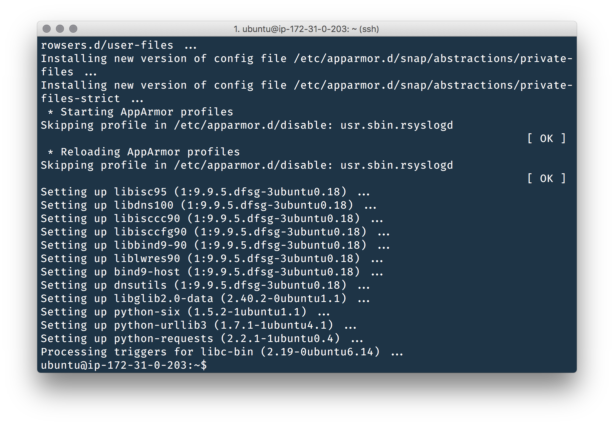

### 1.3 Preparing for the Greengrass Installation

1. <details>
		<summary>Command: `sudo adduser --system ggc_user`</summary>
	
		Output:
		
		Adding system user `ggc_user' (UID 112) ...
		Adding new user `ggc_user' (UID 112) with group `nogroup' ...
		Creating home directory `/home/ggc_user' ...
	</details>

1. <details>
		<summary>Command: `sudo addgroup --system ggc_group`</summary>
	
		Output:
		
		Adding group `ggc_group' (GID 116) ...
		Done.
	</details>

1. Command: `cd /etc/sysctl.d`
	
1. <details>
		<summary>Command: `ls`</summary>
	
		Output:
		
		10-console-messages.conf   10-lxd-inotify.conf       10-zeropage.conf
		10-ipv6-privacy.conf       10-magic-sysrq.conf       99-cloudimg-ipv6.conf
		10-kernel-hardening.conf   10-network-security.conf  99-sysctl.conf
		10-link-restrictions.conf  10-ptrace.conf            README
	</details>

1. Command: `sudo nano 00-defaults.conf`

	Add to the file:

	```
	fs.protected_hardlinks = 1
	fs.protected_symlinks = 1
	```

	`CTRL+O` to save, then `CTRL+X` to exit the editor
	
1. Reboot the EC2 instance to pick-up the configuration changes

	<details>
		<summary>Command: `sudo reboot`
</summary>
	
		Output:
		
		Connection to ec2-34-222-222-74.us-west-2.compute.amazonaws.com closed by remote host.
		Connection to ec2-34-222-222-74.us-west-2.compute.amazonaws.com closed.
	</details>
	
	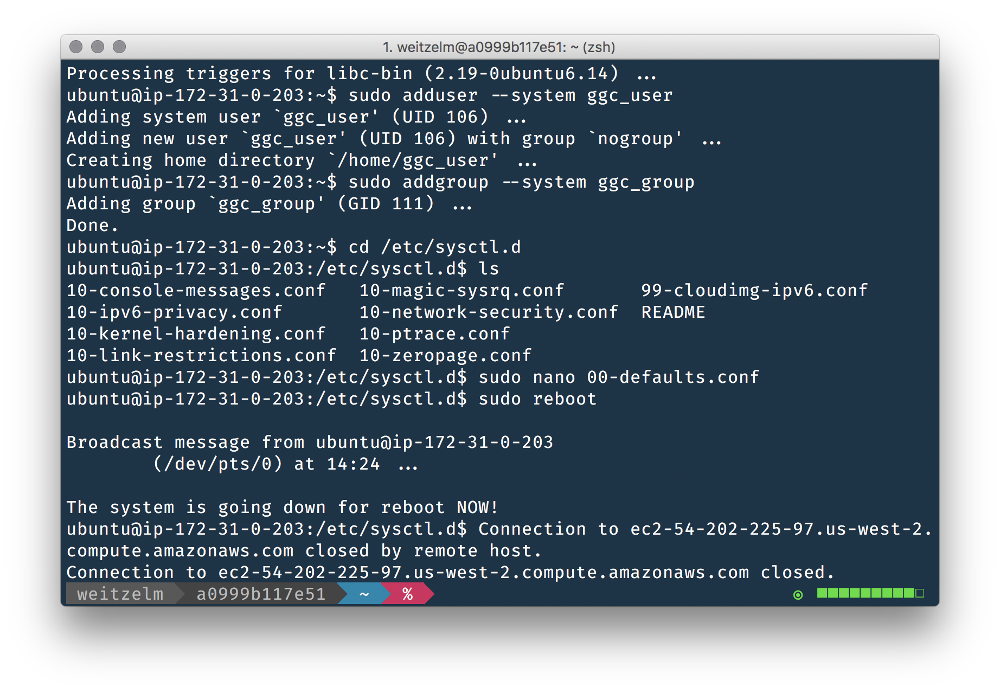
	**NB**: your SSH session will be disconnnected automatically
1. Once the reboot is finished connect back to the EC2 instance using SSH.

	<details>
		<summary>Command: `ssh -i "~/Downloads/SBE_Workshop.pem" ubuntu@ec2-34-222-222-74.us-west-2.compute.amazonaws.com`</summary>
	
		Output:
		
		Welcome to Ubuntu 16.04.5 LTS (GNU/Linux 4.4.0-1067-aws x86_64)
		
		 * Documentation:  https://help.ubuntu.com
		 * Management:     https://landscape.canonical.com
		 * Support:        https://ubuntu.com/advantage
	
	  	Get cloud support with Ubuntu Advantage Cloud Guest:
	​    http://www.ubuntu.com/business/services/cloud
	
		6 packages can be updated.
		6 updates are security updates.
		
		New release '18.04.1 LTS' available.
		Run 'do-release-upgrade' to upgrade to it.
		
		Last login: Fri Oct 26 14:44:13 2018 from 196.32.238.241
	</details>

1. <details>
		<summary>Command: `sudo sysctl -a | grep fs.protected`</summary>
	
		Output:
		
		fs.protected_hardlinks = 1
		fs.protected_symlinks = 1
		sysctl: reading key "net.ipv6.conf.all.stable_secret"
		sysctl: reading key "net.ipv6.conf.default.stable_secret"
		sysctl: reading key "net.ipv6.conf.ens3.stable_secret"
		sysctl: reading key "net.ipv6.conf.lo.stable_secret"
	</details>

1. <details>
		<summary>Command: `curl https://raw.githubusercontent.com/tianon/cgroupfs-mount/951c38ee8d802330454bdede20d85ec1c0f8d312/cgroupfs-mount > cgroupfs-mount.sh`</summary>

		Output:
		
		  % Total    % Received % Xferd  Average Speed   Time    Time     Time  Current
		                                 Dload  Upload   Total   Spent    Left  Speed
		100  1275  100  1275    0     0   7271      0 --:--:-- --:--:-- --:--:--  7285
	</details>

1. Command: `chmod +x cgroupfs-mount.sh`
	
1. Command: `sudo bash ./cgroupfs-mount.sh`

1. Install Python 2.7 and the Python package manager PIP
	
	<details>
		<summary>Command: `sudo apt install python2.7 python-pip -y`</summary>
	
		Output:
		
		Reading package lists... Done
		Building dependency tree
		Reading state information... Done
		The following additional packages will be installed:
		  binutils build-essential cpp cpp-5 dpkg-dev fakeroot g++ g++-5 gcc gcc-5
		  libalgorithm-diff-perl libalgorithm-diff-xs-perl libalgorithm-merge-perl
		  libasan2 libatomic1 libc-dev-bin libc6-dev libcc1-0 libcilkrts5 libdpkg-perl
		  libexpat1-dev libfakeroot libfile-fcntllock-perl libgcc-5-dev libgomp1
		  libisl15 libitm1 liblsan0 libmpc3 libmpx0 libpython-all-dev libpython-dev
		  libpython-stdlib libpython2.7 libpython2.7-dev libpython2.7-minimal
		  libpython2.7-stdlib libquadmath0 libstdc++-5-dev libtsan0 libubsan0
		  linux-libc-dev make manpages-dev python python-all python-all-dev python-dev
		  python-minimal python-pip-whl python-pkg-resources python-setuptools
		  python-wheel python2.7-dev python2.7-minimal
		Suggested packages:
		  binutils-doc cpp-doc gcc-5-locales debian-keyring g++-multilib
		  g++-5-multilib gcc-5-doc libstdc++6-5-dbg gcc-multilib autoconf automake
		  libtool flex bison gdb gcc-doc gcc-5-multilib libgcc1-dbg libgomp1-dbg
		  libitm1-dbg libatomic1-dbg libasan2-dbg liblsan0-dbg libtsan0-dbg
		  libubsan0-dbg libcilkrts5-dbg libmpx0-dbg libquadmath0-dbg glibc-doc
		  libstdc++-5-doc make-doc python-doc python-tk python-setuptools-doc
		  python2.7-doc binfmt-support
		The following NEW packages will be installed:
		  binutils build-essential cpp cpp-5 dpkg-dev fakeroot g++ g++-5 gcc gcc-5
		  libalgorithm-diff-perl libalgorithm-diff-xs-perl libalgorithm-merge-perl
		  libasan2 libatomic1 libc-dev-bin libc6-dev libcc1-0 libcilkrts5 libdpkg-perl
		  libexpat1-dev libfakeroot libfile-fcntllock-perl libgcc-5-dev libgomp1
		  libisl15 libitm1 liblsan0 libmpc3 libmpx0 libpython-all-dev libpython-dev
		  libpython-stdlib libpython2.7 libpython2.7-dev libpython2.7-minimal
		  libpython2.7-stdlib libquadmath0 libstdc++-5-dev libtsan0 libubsan0
		  linux-libc-dev make manpages-dev python python-all python-all-dev python-dev
		  python-minimal python-pip python-pip-whl python-pkg-resources
		  python-setuptools python-wheel python2.7 python2.7-dev python2.7-minimal
		0 upgraded, 57 newly installed, 0 to remove and 3 not upgraded.
		Need to get 72.9 MB of archives.
		After this operation, 209 MB of additional disk space will be used.
		Get:1 http://us-west-2.ec2.archive.ubuntu.com/ubuntu xenial-updates/main amd64 libpython2.7-minimal amd64 2.7.12-1ubuntu0~16.04.3 [340 kB]
		Get:2 http://us-west-2.ec2.archive.ubuntu.com/ubuntu xenial-updates/main amd64 python2.7-minimal amd64 2.7.12-1ubuntu0~16.04.3 [1,261 kB]
		Get:3 http://us-west-2.ec2.archive.ubuntu.com/ubuntu xenial-updates/main amd64 python-minimal amd64 2.7.12-1~16.04 [28.1 kB]
		Get:4 http://us-west-2.ec2.archive.ubuntu.com/ubuntu xenial-updates/main amd64 libpython2.7-stdlib amd64 2.7.12-1ubuntu0~16.04.3 [1,880 kB]
		Get:5 http://us-west-2.ec2.archive.ubuntu.com/ubuntu xenial-updates/main amd64 python2.7 amd64 2.7.12-1ubuntu0~16.04.3 [224 kB]
		Get:6 http://us-west-2.ec2.archive.ubuntu.com/ubuntu xenial-updates/main amd64 libpython-stdlib amd64 2.7.12-1~16.04 [7,768 B]
		Get:7 http://us-west-2.ec2.archive.ubuntu.com/ubuntu xenial-updates/main amd64 python amd64 2.7.12-1~16.04 [137 kB]
		Get:8 http://us-west-2.ec2.archive.ubuntu.com/ubuntu xenial/main amd64 libmpc3 amd64 1.0.3-1 [39.7 kB]
		Get:9 http://us-west-2.ec2.archive.ubuntu.com/ubuntu xenial-updates/main amd64 binutils amd64 2.26.1-1ubuntu1~16.04.7 [2,309 kB]
		Get:10 http://us-west-2.ec2.archive.ubuntu.com/ubuntu xenial-updates/main amd64 libc-dev-bin amd64 2.23-0ubuntu10 [68.7 kB]
		Get:11 http://us-west-2.ec2.archive.ubuntu.com/ubuntu xenial-updates/main amd64 linux-libc-dev amd64 4.4.0-138.164 [859 kB]
		Get:12 http://us-west-2.ec2.archive.ubuntu.com/ubuntu xenial-updates/main amd64 libc6-dev amd64 2.23-0ubuntu10 [2,079 kB]
		Get:13 http://us-west-2.ec2.archive.ubuntu.com/ubuntu xenial/main amd64 libisl15 amd64 0.16.1-1 [524 kB]
		Get:14 http://us-west-2.ec2.archive.ubuntu.com/ubuntu xenial-updates/main amd64 cpp-5 amd64 5.4.0-6ubuntu1~16.04.10 [7,671 kB]
		Get:15 http://us-west-2.ec2.archive.ubuntu.com/ubuntu xenial/main amd64 cpp amd64 4:5.3.1-1ubuntu1 [27.7 kB]
		Get:16 http://us-west-2.ec2.archive.ubuntu.com/ubuntu xenial-updates/main amd64 libcc1-0 amd64 5.4.0-6ubuntu1~16.04.10 [38.8 kB]
		Get:17 http://us-west-2.ec2.archive.ubuntu.com/ubuntu xenial-updates/main amd64 libgomp1 amd64 5.4.0-6ubuntu1~16.04.10 [55.1 kB]
		Get:18 http://us-west-2.ec2.archive.ubuntu.com/ubuntu xenial-updates/main amd64 libitm1 amd64 5.4.0-6ubuntu1~16.04.10 [27.4 kB]
		Get:19 http://us-west-2.ec2.archive.ubuntu.com/ubuntu xenial-updates/main amd64 libatomic1 amd64 5.4.0-6ubuntu1~16.04.10 [8,888 B]
		Get:20 http://us-west-2.ec2.archive.ubuntu.com/ubuntu xenial-updates/main amd64 libasan2 amd64 5.4.0-6ubuntu1~16.04.10 [264 kB]
		Get:21 http://us-west-2.ec2.archive.ubuntu.com/ubuntu xenial-updates/main amd64 liblsan0 amd64 5.4.0-6ubuntu1~16.04.10 [105 kB]
		Get:22 http://us-west-2.ec2.archive.ubuntu.com/ubuntu xenial-updates/main amd64 libtsan0 amd64 5.4.0-6ubuntu1~16.04.10 [244 kB]
		Get:23 http://us-west-2.ec2.archive.ubuntu.com/ubuntu xenial-updates/main amd64 libubsan0 amd64 5.4.0-6ubuntu1~16.04.10 [95.3 kB]
		Get:24 http://us-west-2.ec2.archive.ubuntu.com/ubuntu xenial-updates/main amd64 libcilkrts5 amd64 5.4.0-6ubuntu1~16.04.10 [40.1 kB]
		Get:25 http://us-west-2.ec2.archive.ubuntu.com/ubuntu xenial-updates/main amd64 libmpx0 amd64 5.4.0-6ubuntu1~16.04.10 [9,764 B]
		Get:26 http://us-west-2.ec2.archive.ubuntu.com/ubuntu xenial-updates/main amd64 libquadmath0 amd64 5.4.0-6ubuntu1~16.04.10 [131 kB]
		Get:27 http://us-west-2.ec2.archive.ubuntu.com/ubuntu xenial-updates/main amd64 libgcc-5-dev amd64 5.4.0-6ubuntu1~16.04.10 [2,228 kB]
		Get:28 http://us-west-2.ec2.archive.ubuntu.com/ubuntu xenial-updates/main amd64 gcc-5 amd64 5.4.0-6ubuntu1~16.04.10 [8,426 kB]
		Get:29 http://us-west-2.ec2.archive.ubuntu.com/ubuntu xenial/main amd64 gcc amd64 4:5.3.1-1ubuntu1 [5,244 B]
		Get:30 http://us-west-2.ec2.archive.ubuntu.com/ubuntu xenial-updates/main amd64 libstdc++-5-dev amd64 5.4.0-6ubuntu1~16.04.10 [1,426 kB]
		Get:31 http://us-west-2.ec2.archive.ubuntu.com/ubuntu xenial-updates/main amd64 g++-5 amd64 5.4.0-6ubuntu1~16.04.10 [8,319 kB]
		Get:32 http://us-west-2.ec2.archive.ubuntu.com/ubuntu xenial/main amd64 g++ amd64 4:5.3.1-1ubuntu1 [1,504 B]
		Get:33 http://us-west-2.ec2.archive.ubuntu.com/ubuntu xenial/main amd64 make amd64 4.1-6 [151 kB]
		Get:34 http://us-west-2.ec2.archive.ubuntu.com/ubuntu xenial-updates/main amd64 libdpkg-perl all 1.18.4ubuntu1.4 [195 kB]
		Get:35 http://us-west-2.ec2.archive.ubuntu.com/ubuntu xenial-updates/main amd64 dpkg-dev all 1.18.4ubuntu1.4 [584 kB]
		Get:36 http://us-west-2.ec2.archive.ubuntu.com/ubuntu xenial/main amd64 build-essential amd64 12.1ubuntu2 [4,758 B]
		Get:37 http://us-west-2.ec2.archive.ubuntu.com/ubuntu xenial/main amd64 libfakeroot amd64 1.20.2-1ubuntu1 [25.5 kB]
		Get:38 http://us-west-2.ec2.archive.ubuntu.com/ubuntu xenial/main amd64 fakeroot amd64 1.20.2-1ubuntu1 [61.8 kB]
		Get:39 http://us-west-2.ec2.archive.ubuntu.com/ubuntu xenial/main amd64 libalgorithm-diff-perl all 1.19.03-1 [47.6 kB]
		Get:40 http://us-west-2.ec2.archive.ubuntu.com/ubuntu xenial/main amd64 libalgorithm-diff-xs-perl amd64 0.04-4build1 [11.0 kB]
		Get:41 http://us-west-2.ec2.archive.ubuntu.com/ubuntu xenial/main amd64 libalgorithm-merge-perl all 0.08-3 [12.0 kB]
		Get:42 http://us-west-2.ec2.archive.ubuntu.com/ubuntu xenial-updates/main amd64 libexpat1-dev amd64 2.1.0-7ubuntu0.16.04.3 [115 kB]
		Get:43 http://us-west-2.ec2.archive.ubuntu.com/ubuntu xenial/main amd64 libfile-fcntllock-perl amd64 0.22-3 [32.0 kB]
		Get:44 http://us-west-2.ec2.archive.ubuntu.com/ubuntu xenial-updates/main amd64 libpython2.7 amd64 2.7.12-1ubuntu0~16.04.3 [1,070 kB]
		Get:45 http://us-west-2.ec2.archive.ubuntu.com/ubuntu xenial-updates/main amd64 libpython2.7-dev amd64 2.7.12-1ubuntu0~16.04.3 [27.8 MB]
		Get:46 http://us-west-2.ec2.archive.ubuntu.com/ubuntu xenial-updates/main amd64 libpython-dev amd64 2.7.12-1~16.04 [7,840 B]
		Get:47 http://us-west-2.ec2.archive.ubuntu.com/ubuntu xenial-updates/main amd64 update-alternatives: using /usr/bin/fakeroot-sysv to provide /usr/bin/fakeroot (fakeroot) in auto mode
		Setting up libalgorithm-diff-perl (1.19.03-1) ...
		Setting up libalgorithm-diff-xs-perl (0.04-4build1) ...
		Setting up libalgorithm-merge-perl (0.08-3) ...
		Setting up libexpat1-dev:amd64 (2.1.0-7ubuntu0.16.04.3) ...
		Setting up libfile-fcntllock-perl (0.22-3) ...
		Setting up libpython2.7:amd64 (2.7.12-1ubuntu0~16.04.3) ...
		Setting up libpython2.7-dev:amd64 (2.7.12-1ubuntu0~16.04.3) ...
		Setting up libpython-dev:amd64 (2.7.12-1~16.04) ...
		Setting up libpython-all-dev:amd64 (2.7.12-1~16.04) ...
		Setting up manpages-dev (4.04-2) ...
		Setting up python-all (2.7.12-1~16.04) ...
		Setting up python2.7-dev (2.7.12-1ubuntu0~16.04.3) ...
		Setting up python-dev (2.7.12-1~16.04) ...
		Setting up python-all-dev (2.7.12-1~16.04) ...
		Setting up python-pip-whl (8.1.1-2ubuntu0.4) ...
		Setting up python-pip (8.1.1-2ubuntu0.4) ...
		Setting up python-pkg-resources (20.7.0-1) ...
		Setting up python-setuptools (20.7.0-1) ...
		Setting up python-wheel (0.29.0-1) ...
		Processing triggers for libc-bin (2.23-0ubuntu10) ...
	</details>

1. <details>
		<summary>Command: `sudo apt-get install git -y`</summary>
	
		Output:
		
		Reading package lists... Done
		Building dependency tree
		Reading state information... Done
		git is already the newest version (1:2.7.4-0ubuntu1.5).
		0 upgraded, 0 newly installed, 0 to remove and 3 not upgraded.
	</details>

1. <details>
		<summary>Command: `git clone https://github.com/aws-samples/aws-greengrass-samples.git`</summary>

		Output:
		
		Cloning into 'aws-greengrass-samples'...
		remote: Enumerating objects: 141, done.
		remote: Total 141 (delta 0), reused 0 (delta 0), pack-reused 141
		Receiving objects: 100% (141/141), 91.08 KiB | 0 bytes/s, done.
		Resolving deltas: 100% (64/64), done.
		Checking connectivity... done.
	</details>

1. Command: `cd aws-greengrass-samples/greengrass-dependency-checker-GGCv1.6.0/`

1. Run the dependency checker to ascertain that the EC2 instance is correctly configured

   <details>
   	<summary>Command: `sudo ./check_ggc_dependencies`</summary>

   	Output:
   	
   	==========================Checking script dependencies==============================
   	The device has all commands required for the script to run.
   	
   	========================Dependency check report for GGC v1.6=========================
   	System configuration:
   	Kernel architecture: x86_64
   	Init process: /lib/systemd/systemd
   	Kernel version: 4.4
   	C library: Ubuntu GLIBC 2.23-0ubuntu10
   	C library version: 2.23
   	Directory /var/run: Present
   	/dev/stdin: Found
   	/dev/stdout: Found
   	/dev/stderr: Found
   	
   	--------------------------------Kernel configuration--------------------------------
   	Kernel config file: /boot/config-4.4.0-1067-aws
   	
   	Namespace configs:
   	CONFIG_IPC_NS: Enabled
   	CONFIG_UTS_NS: Enabled
   	CONFIG_USER_NS: Enabled
   	CONFIG_PID_NS: Enabled
   	
   	Cgroup configs:
   	CONFIG_CGROUP_DEVICE: Enabled
   	CONFIG_CGROUPS: Enabled
   	CONFIG_MEMCG: Enabled
   	
   	Other required configs:
   	CONFIG_POSIX_MQUEUE: Enabled
   	CONFIG_OVERLAY_FS: Enabled
   	CONFIG_HAVE_ARCH_SECCOMP_FILTER: Enabled
   	CONFIG_SECCOMP_FILTER: Enabled
   	CONFIG_KEYS: Enabled
   	CONFIG_SECCOMP: Enabled
   	
   	------------------------------------Cgroups check-----------------------------------
   	Cgroups mount directory: /sys/fs/cgroup
   	
   	Devices cgroup: Enabled and Mounted
   	Memory cgroup: Enabled and Mounted
   	
   	----------------------------Commands and software packages--------------------------
   	Python version: 2.7.12
   	NodeJS 6.10: Not found
   	Java 8: Not found
   	OpenSSL version: 1.0.2
   	wget: Present
   	realpath: Present
   	tar: Present
   	readlink: Present
   	basename: Present
   	dirname: Present
   	pidof: Present
   	df: Present
   	grep: Present
   	umount: Present
   	
   	---------------------------------Platform security----------------------------------
   	Hardlinks_protection: Enabled
   	Symlinks protection: Enabled
   	
   	-----------------------------------User and group-----------------------------------
   	ggc_user: Present
   	ggc_group: Present
   	
   	------------------------------------Results-----------------------------------------
   	Note:
   	1. It looks like the kernel uses 'systemd' as the init process. Be sure to set the
   	'useSystemd' field in the file 'config.json' to 'yes' when configuring Greengrass core.
   	
   	Missing optional dependencies:
   	1. Could not find the binary 'nodejs6.10'.
   	
   	If NodeJS 6.10 or later is installed on the device, name the binary 'nodejs6.10' and
   	add its parent directory to the PATH environment variable. NodeJS 6.10 or later is
   	required to execute NodeJS lambdas on Greengrass core.
   	
   	2. Could not find the binary 'java8'.
   	
   	If Java 8 or later is installed on the device name the binary 'java8' and add its
   	parent directory to the PATH environment variable. Java 8 or later is required to
   	execute Java lambdas on Greengrass core.


   ​	
   	----------------------------------Exit status---------------------------------------
   	You can now proceed to installing the Greengrass core 1.6 software on the device.
   	Please reach out to the AWS Greengrass support if issues arise.
   </details>

### 1.4 Greengrass creation in the AWS Management Console

1. In your browser, bring up the AWS Management Console, change to the AWS IoT Core service and select the Greengrass category and select to **Get Started** in `Define a Greengrass Group` section
	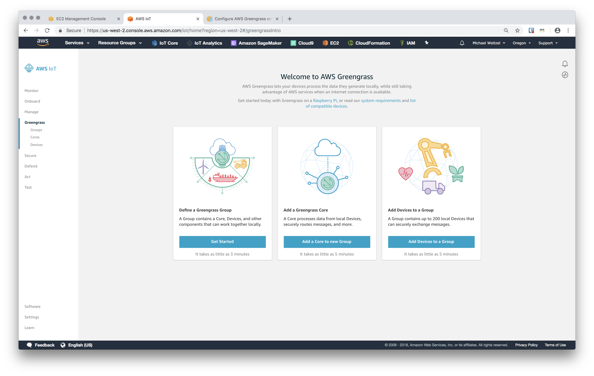

1. Select **Use easy creation** button
	

1. Name your group `sbe_workshop` and select **Next**
	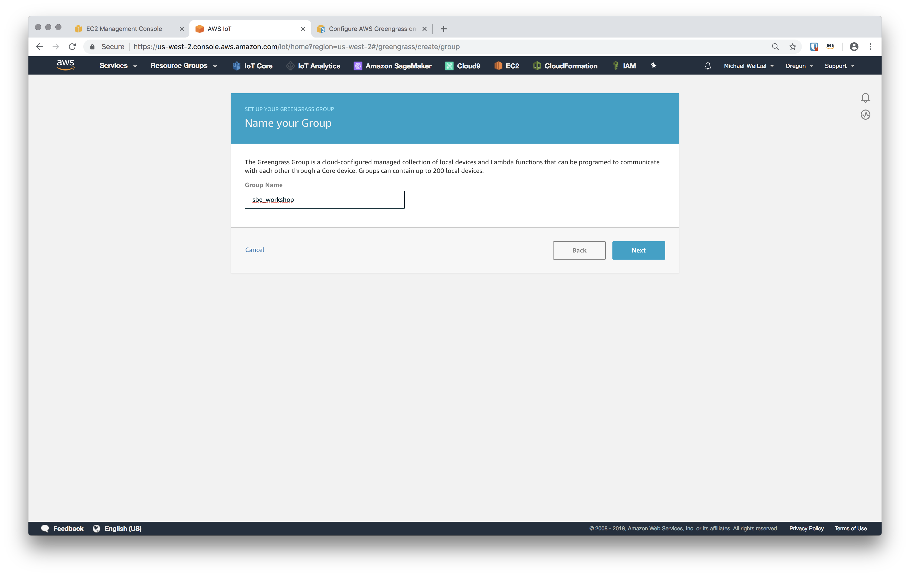

1. Confirm the name of the Greengrass Group's Core is `sbe_workshop_Core` and select **Next**
	

1. Select to **Create Group and Core**
	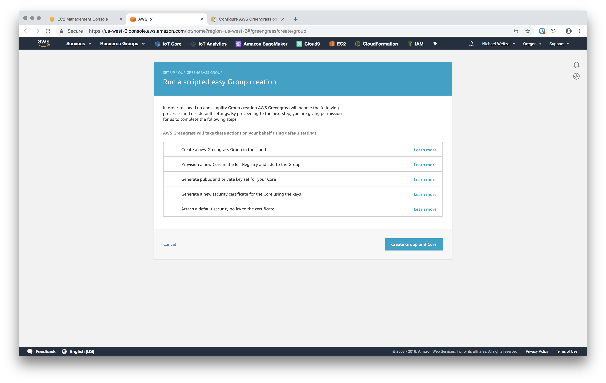
	
1. Select to **Download these resources as a tar.gz**
	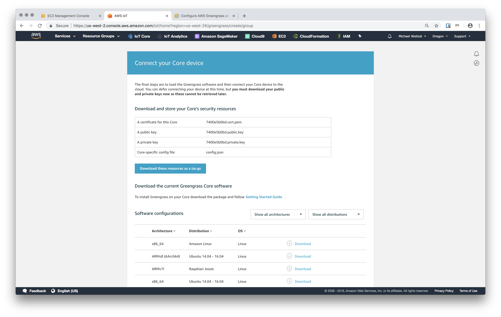
	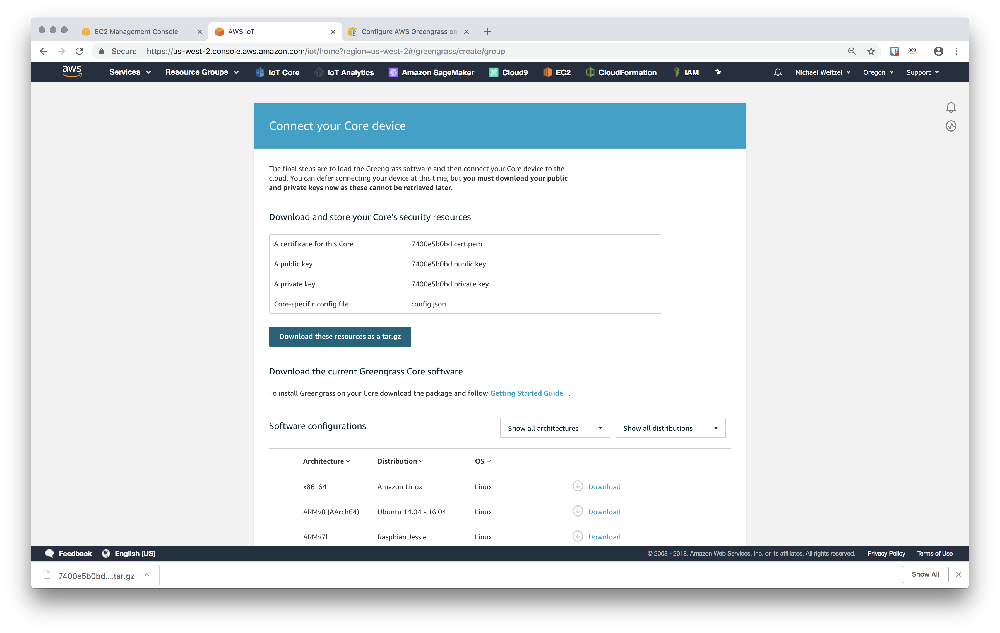
	
1. Scroll down the page and download the correct Greengrass binary for your system, in our case this should be `x86_64  Ubuntu 14.04 - 16.04  Linux` select the **Download** link next to it
	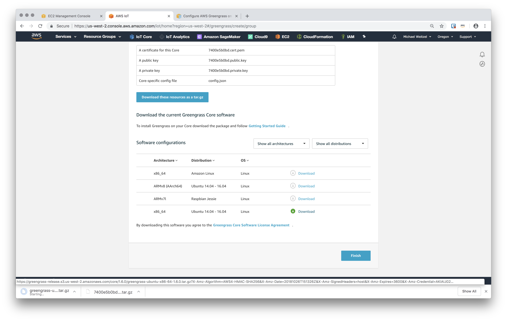
	
1. Confirm that the Greengrass Group was successfully created
	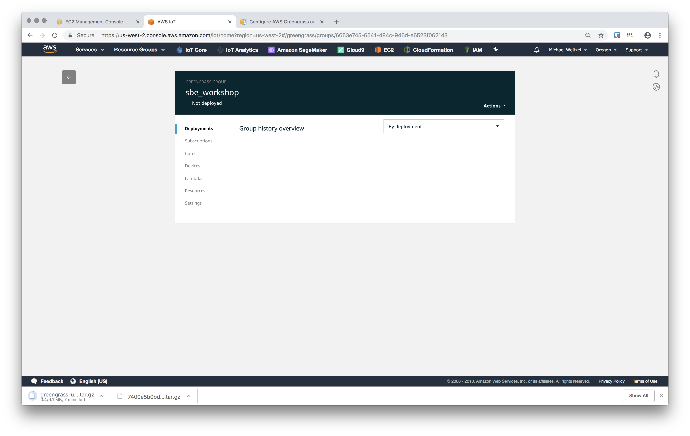

### 1.5 Setting up Greengrass on the EC2 instance

Greengrass will allow you to execute Lambda functions 

1. Copy tarball with the certificate and configuration information from your computer to the EC2 instance

  <details>
  	<summary>Command: `scp -i "~/Downloads/SBE_Workshop.pem" ~/Downloads/7400e5b0bd-setup.tar.gz ubuntu@ec2-34-222-222-74.us-west-2.compute.amazonaws.com:/home/ubuntu/`</summary>


  	Output:
  	
  	7400e5b0bd-setup.tar.gz                       100% 2743     7.8KB/s   00:00
  </details>

1. Copy the Greengrass binaries from your computer to the EC2 instance

	<details>
		<summary>Command: `scp -i "~/Downloads/SBE_Workshop.pem" ~/Downloads/greengrass-ubuntu-x86-64-1.6.0.tar.gz ubuntu@ec2-34-222-222-74.us-west-2.compute.amazonaws.com:/home/ubuntu`</summary>
	
		Ouput:
		
		greengrass-ubuntu-x86-64-1.6.0.tar.gz         100% 9364KB  64.0KB/s   02:26
	</details>
	
1. On the EC2 instance extract the Greengrass binaries

	<details>
		<summary>Command: `sudo tar -xzvf greengrass-ubuntu-x86-64-1.6.0.tar.gz -C /`</summary>
	
		Output:
		
		greengrass/
		greengrass/certs/
		greengrass/certs/README
		greengrass/ggc/
		greengrass/ggc/core
		greengrass/ggc/packages/
		greengrass/ggc/packages/1.6.0/
		greengrass/ggc/packages/1.6.0/lambda/
		greengrass/ggc/packages/1.6.0/lambda/arn:aws:lambda:::function:GGShadowSyncManager
		greengrass/ggc/packages/1.6.0/lambda/arn:aws:lambda:::function:GGShadowService
		greengrass/ggc/packages/1.6.0/lambda/arn:aws:lambda:::function:GGCloudSpooler:1
		greengrass/ggc/packages/1.6.0/lambda/arn:aws:lambda:::function:GGTES
		greengrass/ggc/packages/1.6.0/lambda/arn:aws:lambda:::function:GGConnManager
		greengrass/ggc/packages/1.6.0/lambda/GreengrassSystemComponents/
		greengrass/ggc/packages/1.6.0/lambda/GreengrassSystemComponents/greengrassSystemComponents
		greengrass/ggc/packages/1.6.0/lambda/arn:aws:lambda:::function:GGIPDetector:1/
		greengrass/ggc/packages/1.6.0/lambda/arn:aws:lambda:::function:GGIPDetector:1/ipdetector
		greengrass/ggc/packages/1.6.0/lambda/arn:aws:lambda:::function:GGDeviceCertificateManager
		greengrass/ggc/packages/1.6.0/release_notes_1_6_0.html
		greengrass/ggc/packages/1.6.0/runtime/
		greengrass/ggc/packages/1.6.0/runtime/java8/
		greengrass/ggc/packages/1.6.0/runtime/java8/aws-greengrass-ipc-java-sdk-1.0.jar
		greengrass/ggc/packages/1.6.0/runtime/java8/aws-greengrass-java-common-1.0.jar
		greengrass/ggc/packages/1.6.0/runtime/java8/aws-greengrass-java-lambda-runtime-1.0.jar
		greengrass/ggc/packages/1.6.0/runtime/nodejs6.10/
		greengrass/ggc/packages/1.6.0/runtime/nodejs6.10/try.js
		greengrass/ggc/packages/1.6.0/runtime/nodejs6.10/node_modules/
		greengrass/ggc/packages/1.6.0/runtime/nodejs6.10/node_modules/aws-greengrass-common-js/
		greengrass/ggc/packages/1.6.0/runtime/nodejs6.10/node_modules/aws-greengrass-common-js/localWatchLogger.js
		greengrass/ggc/packages/1.6.0/runtime/nodejs6.10/node_modules/aws-greengrass-common-js/functionArnFields.js
		greengrass/ggc/packages/1.6.0/runtime/nodejs6.10/node_modules/aws-greengrass-common-js/retry.js
		greengrass/ggc/packages/1.6.0/runtime/nodejs6.10/node_modules/aws-greengrass-common-js/index.js
		greengrass/ggc/packages/1.6.0/runtime/nodejs6.10/node_modules/aws-greengrass-common-js/versionParser.js
		greengrass/ggc/packages/1.6.0/runtime/nodejs6.10/node_modules/aws-greengrass-common-js/encodingType.js
		greengrass/ggc/packages/1.6.0/runtime/nodejs6.10/node_modules/aws-greengrass-common-js/config.js
		greengrass/ggc/packages/1.6.0/runtime/nodejs6.10/node_modules/aws-greengrass-common-js/envVars.js
		greengrass/ggc/packages/1.6.0/runtime/nodejs6.10/node_modules/aws-greengrass-ipc-sdk-js/
		greengrass/ggc/packages/1.6.0/runtime/nodejs6.10/node_modules/aws-greengrass-ipc-sdk-js/ipcclient.js
		greengrass/ggc/packages/1.6.0/runtime/nodejs6.10/node_modules/aws-greengrass-ipc-sdk-js/index.js
		greengrass/ggc/packages/1.6.0/runtime/nodejs6.10/redirect.js
		greengrass/ggc/packages/1.6.0/runtime/nodejs6.10/start.js
		greengrass/ggc/packages/1.6.0/runtime/nodejs6.10/lambda_nodejs_runtime.js
		greengrass/ggc/packages/1.6.0/runtime/python2.7/
		greengrass/ggc/packages/1.6.0/runtime/python2.7/lambda_runtime.pyc
		greengrass/ggc/packages/1.6.0/runtime/python2.7/greengrass_ipc_python_sdk/
		greengrass/ggc/packages/1.6.0/runtime/python2.7/greengrass_ipc_python_sdk/ipc_client.py
		greengrass/ggc/packages/1.6.0/runtime/python2.7/greengrass_ipc_python_sdk/__init__.pyc
		greengrass/ggc/packages/1.6.0/runtime/python2.7/greengrass_ipc_python_sdk/__init__.py
		greengrass/ggc/packages/1.6.0/runtime/python2.7/greengrass_ipc_python_sdk/utils/
		greengrass/ggc/packages/1.6.0/runtime/python2.7/greengrass_ipc_python_sdk/utils/__init__.pyc
		greengrass/ggc/packages/1.6.0/runtime/python2.7/greengrass_ipc_python_sdk/utils/__init__.py
		greengrass/ggc/packages/1.6.0/runtime/python2.7/greengrass_ipc_python_sdk/utils/exponential_backoff.pyc
		greengrass/ggc/packages/1.6.0/runtime/python2.7/greengrass_ipc_python_sdk/utils/exponential_backoff.py
		greengrass/ggc/packages/1.6.0/runtime/python2.7/greengrass_ipc_python_sdk/ipc_client.pyc
		greengrass/ggc/packages/1.6.0/runtime/python2.7/greengrass_common/
		greengrass/ggc/packages/1.6.0/runtime/python2.7/greengrass_common/parse_version.pyc
		greengrass/ggc/packages/1.6.0/runtime/python2.7/greengrass_common/env_vars.py
		greengrass/ggc/packages/1.6.0/runtime/python2.7/greengrass_common/common_log_appender.pyc
		greengrass/ggc/packages/1.6.0/runtime/python2.7/greengrass_common/__init__.pyc
		greengrass/ggc/packages/1.6.0/runtime/python2.7/greengrass_common/parse_version.py
		greengrass/ggc/packages/1.6.0/runtime/python2.7/greengrass_common/__init__.py
		greengrass/ggc/packages/1.6.0/runtime/python2.7/greengrass_common/env_vars.pyc
		greengrass/ggc/packages/1.6.0/runtime/python2.7/greengrass_common/encoding_type.pyc
		greengrass/ggc/packages/1.6.0/runtime/python2.7/greengrass_common/common_log_appender.py
		greengrass/ggc/packages/1.6.0/runtime/python2.7/greengrass_common/greengrass_message.py
		greengrass/ggc/packages/1.6.0/runtime/python2.7/greengrass_common/greengrass_message.pyc
		greengrass/ggc/packages/1.6.0/runtime/python2.7/greengrass_common/function_arn_fields.pyc
		greengrass/ggc/packages/1.6.0/runtime/python2.7/greengrass_common/function_arn_fields.py
		greengrass/ggc/packages/1.6.0/runtime/python2.7/greengrass_common/encoding_type.py
		greengrass/ggc/packages/1.6.0/runtime/python2.7/__init__.pyc
		greengrass/ggc/packages/1.6.0/runtime/python2.7/__init__.py
		greengrass/ggc/packages/1.6.0/runtime/python2.7/lambda_runtime.py
		greengrass/ggc/packages/1.6.0/runtime/executable/
		greengrass/ggc/packages/1.6.0/runtime/executable/libaws-greengrass-core-sdk-c.so
		greengrass/ggc/packages/1.6.0/bin/
		greengrass/ggc/packages/1.6.0/bin/daemon
		greengrass/ggc/packages/1.6.0/LICENSE/
		greengrass/ggc/packages/1.6.0/LICENSE/attributions/
		greengrass/ggc/packages/1.6.0/LICENSE/attributions/github_docker_docker_License.txt
		greengrass/ggc/packages/1.6.0/LICENSE/attributions/github_seccomp_libseccomp_golang_License.txt
		greengrass/ggc/packages/1.6.0/LICENSE/attributions/github_godbus_dbus_License.txt
		greengrass/ggc/packages/1.6.0/LICENSE/attributions/github_pquerna_ffjson_License.txt
		greengrass/ggc/packages/1.6.0/LICENSE/attributions/github_coreos_go_systemd_License.txt
		greengrass/ggc/packages/1.6.0/LICENSE/attributions/github_huin_gobinarytest_License.txt
		greengrass/ggc/packages/1.6.0/LICENSE/attributions/github_syndtr_gocapability_License.txt
		greengrass/ggc/packages/1.6.0/LICENSE/attributions/github_huin_mqtt_License.txt
		greengrass/ggc/packages/1.6.0/LICENSE/attributions/github_docker_go_units_License.txt
		greengrass/ggc/packages/1.6.0/LICENSE/attributions/github_fsnotify_fsnotify_License.txt
		greengrass/ggc/packages/1.6.0/LICENSE/attributions/github_opencontainers_runc_License.txt
		greengrass/ggc/packages/1.6.0/LICENSE/attributions/github_opencontainers_runtime_spec_License.txt
		greengrass/ggc/packages/1.6.0/LICENSE/attributions/github_Sirupsen_logrus_License.txt
		greengrass/ggc/packages/1.6.0/LICENSE/attributions/curl_haxx_se_License.txt
		greengrass/ggc/packages/1.6.0/LICENSE/attributions/github_urfave_cli_License.txt
		greengrass/ggc/packages/1.6.0/LICENSE/attributions/github_vishvananda_netlink_License.txt
		greengrass/ggc/packages/1.6.0/LICENSE/attributions/sqlite_org_License.txt
		greengrass/ggc/packages/1.6.0/LICENSE/attributions/github_jmespath_go_jmespath_License.txt
		greengrass/ggc/packages/1.6.0/LICENSE/attributions/github_paho_mqtt_License.txt
		greengrass/ggc/packages/1.6.0/LICENSE/attributions/github_golang_protobuf_License.txt
		greengrass/ggc/packages/1.6.0/LICENSE/attributions/Golang_License.txt
		greengrass/ggc/packages/1.6.0/LICENSE/attributions/github_aws_aws_sdk_go_License.txt
		greengrass/ggc/packages/1.6.0/LICENSE/attributions/libb64_sourceforge_License.txt
		greengrass/ggc/packages/1.6.0/LICENSE/attributions/github_mattn_go_sqlite3_License.txt
		greengrass/ggc/packages/1.6.0/LICENSE/attributions/github_jeffallen_mqtt_License.txt
		greengrass/ggc/packages/1.6.0/LICENSE/attributions/github_go_ini_ini_License.txt
		greengrass/ggc/packages/1.6.0/LICENSE/attributions/github_nu7hatch_gouuid_License.txt
		greengrass/ggc/packages/1.6.0/LICENSE/Greengrass AWS SW License (IoT additional) vr6.txt
		greengrass/ggc/packages/1.6.0/greengrassd
		greengrass/config/
		greengrass/config/config.json
		greengrass/ota/
		greengrass/ota/ota_agent_v1.0.0/
		greengrass/ota/ota_agent_v1.0.0/ggc-ota
		greengrass/ota/ota_agent_v1.0.0/LICENSE/
		greengrass/ota/ota_agent_v1.0.0/LICENSE/attributions/
		greengrass/ota/ota_agent_v1.0.0/LICENSE/attributions/github_davegamble_cjson_License.txt
		greengrass/ota/ota_agent_v1.0.0/LICENSE/attributions/github_eclipse_mosquitto_License.txt
		greengrass/ota/ota_agent_v1.0.0/LICENSE/Greengrass AWS SW License vr6.txt
		greengrass/ota/ota_agent
	</details>
	
1. Extract the certificate and configuration information into the `/greengrass` directory

	<details>
		<summary>Command: `sudo tar -xzvf 7400e5b0bd-setup.tar.gz -C /greengrass`</summary>
	
		Output:
		
		certs/7400e5b0bd.cert.pem
		certs/7400e5b0bd.private.key
		certs/7400e5b0bd.public.key
		config/config.json
	</details>
	
1. Command: `cd /greengrass/certs/`
	
1. <details>
		<summary>Command: `sudo wget -O root.ca.pem http://www.symantec.com/content/en/us/enterprise/verisign/roots/VeriSign-Class%203-Public-Primary-Certification-Authority-G5.pem`</summary>
	
		Output:
		
		--2018-10-26 15:31:55--  http://www.symantec.com/content/en/us/enterprise/verisign/roots/VeriSign-Class%203-Public-Primary-Certification-Authority-G5.pem
		Resolving www.symantec.com (www.symantec.com)... 23.195.225.59, 2600:1409:0:58c::145b, 2600:1409:0:595::145b
		Connecting to www.symantec.com (www.symantec.com)|23.195.225.59|:80... connected.
		HTTP request sent, awaiting response... 200 OK
		Length: 1758 (1.7K) [text/plain]
		Saving to: ‘root.ca.pem’
		
		root.ca.pem         100%[===================>]   1.72K  --.-KB/s    in 0s
		
		2018-10-26 15:31:55 (151 MB/s) - ‘root.ca.pem’ saved [1758/1758]
	</details>

1. Verify that the certificate is not empty

	<details>
		<summary>Command: `cat root.ca.pem`</summary>
	
		Output:
		
		-----BEGIN CERTIFICATE-----
		MIIE0zCCA7ugAwIBAgIQGNrRniZ96LtKIVjNzGs7SjANBgkqhkiG9w0BAQUFADCB
		yjELMAkGA1UEBhMCVVMxFzAVBgNVBAoTDlZlcmlTaWduLCBJbmMuMR8wHQYDVQQL
		ExZWZXJpU2lnbiBUcnVzdCBOZXR3b3JrMTowOAYDVQQLEzEoYykgMjAwNiBWZXJp
		U2lnbiwgSW5jLiAtIEZvciBhdXRob3JpemVkIHVzZSBvbmx5MUUwQwYDVQQDEzxW
		ZXJpU2lnbiBDbGFzcyAzIFB1YmxpYyBQcmltYXJ5IENlcnRpZmljYXRpb24gQXV0
		aG9yaXR5IC0gRzUwHhcNMDYxMTA4MDAwMDAwWhcNMzYwNzE2MjM1OTU5WjCByjEL
		MAkGA1UEBhMCVVMxFzAVBgNVBAoTDlZlcmlTaWduLCBJbmMuMR8wHQYDVQQLExZW
		ZXJpU2lnbiBUcnVzdCBOZXR3b3JrMTowOAYDVQQLEzEoYykgMjAwNiBWZXJpU2ln
		biwgSW5jLiAtIEZvciBhdXRob3JpemVkIHVzZSBvbmx5MUUwQwYDVQQDEzxWZXJp
		U2lnbiBDbGFzcyAzIFB1YmxpYyBQcmltYXJ5IENlcnRpZmljYXRpb24gQXV0aG9y
		aXR5IC0gRzUwggEiMA0GCSqGSIb3DQEBAQUAA4IBDwAwggEKAoIBAQCvJAgIKXo1
		nmAMqudLO07cfLw8RRy7K+D+KQL5VwijZIUVJ/XxrcgxiV0i6CqqpkKzj/i5Vbex
		t0uz/o9+B1fs70PbZmIVYc9gDaTY3vjgw2IIPVQT60nKWVSFJuUrjxuf6/WhkcIz
		SdhDY2pSS9KP6HBRTdGJaXvHcPaz3BJ023tdS1bTlr8Vd6Gw9KIl8q8ckmcY5fQG
		BO+QueQA5N06tRn/Arr0PO7gi+s3i+z016zy9vA9r911kTMZHRxAy3QkGSGT2RT+
		rCpSx4/VBEnkjWNHiDxpg8v+R70rfk/Fla4OndTRQ8Bnc+MUCH7lP59zuDMKz10/
		NIeWiu5T6CUVAgMBAAGjgbIwga8wDwYDVR0TAQH/BAUwAwEB/zAOBgNVHQ8BAf8E
		BAMCAQYwbQYIKwYBBQUHAQwEYTBfoV2gWzBZMFcwVRYJaW1hZ2UvZ2lmMCEwHzAH
		BgUrDgMCGgQUj+XTGoasjY5rw8+AatRIGCx7GS4wJRYjaHR0cDovL2xvZ28udmVy
		aXNpZ24uY29tL3ZzbG9nby5naWYwHQYDVR0OBBYEFH/TZafC3ey78DAJ80M5+gKv
		MzEzMA0GCSqGSIb3DQEBBQUAA4IBAQCTJEowX2LP2BqYLz3q3JktvXf2pXkiOOzE
		p6B4Eq1iDkVwZMXnl2YtmAl+X6/WzChl8gGqCBpH3vn5fJJaCGkgDdk+bW48DW7Y
		5gaRQBi5+MHt39tBquCWIMnNZBU4gcmU7qKEKQsTb47bDN0lAtukixlE0kF6BWlK
		WE9gyn6CagsCqiUXObXbf+eEZSqVir2G3l6BFoMtEMze/aiCKm0oHw0LxOXnGiYZ
		4fQRbxC1lfznQgUy286dUV4otp6F01vvpX1FQHKOtw5rDgb7MzVIcbidJ4vEZV8N
		hnacRHr2lVz2XTIIM6RUthg/aFzyQkqFOFSDX9HoLPKsEdao7WNq
	</details>
	
1. Command: `cd /greengrass/ggc/core/`

1. <details>
		<summary>Command: `sudo ./greengrassd start`</summary>
		Output:
	
		Setting up greengrass daemon
		Validating hardlink/softlink protection
		Found cgroup subsystem:  blkio
		Found cgroup subsystem:  hugetlb
		Found cgroup subsystem:  perf_event
		Found cgroup subsystem:  devices
		Found cgroup subsystem:  net_cls
		Found cgroup subsystem:  net_prio
		Found cgroup subsystem:  memory
		Found cgroup subsystem:  freezer
		Found cgroup subsystem:  pids
		Found cgroup subsystem:  cpu
		Found cgroup subsystem:  cpuacct
		Found cgroup subsystem:  cpuset
		Found cgroup subsystem:  name=systemd
		
		Greengrass successfully started with PID:  7452
	</details>

1. Verify that the Greengrass daemon is running

	<details>
		<summary>Command: `ps aux | grep greengrassd`</summary>
	
		Output:
		
		root      7452  0.4  0.0 646800 20832 pts/0    Sl   15:38   0:00 /greengrass/ggc/packages/1.6.0/bin/daemon -core-dir /greengrass/ggc/packages/1.6.0 -greengrassdPid 7447
		ubuntu    7570  0.0  0.0  12944   968 pts/0    S+   15:38   0:00 grep --color=auto greengrassd
	</deatils>

### 1.6 Configure S3
Development branch: Create and configure a S3 bucket
​	You will need one prefix for for input files, one for output files, and one for translated files
​	
In Production you would create a S3 endpoint on the Snowball Edge itself. 

### Lambda 

We will now setup a lambda function on Greengrass to trigger our Machine Learning pose estimation software

AWS Greengrass provides a containerized Lambda runtime environment for user-defined code. Lambda functions that are deployed to an AWS Greengrass core run in the core's local Lambda runtime. Local Lambda functions can be triggered by local events, messages from the cloud, and other sources, which brings local compute functionality to connected devices. For example, you can use Greengrass Lambda functions to filter device data before transmitting the data to the cloud.

To deploy a Lambda function to a core, you add the function to a Greengrass group (by referencing the existing Lambda function), configure group-specific settings for the function, and then deploy the group. If the function accesses AWS services, you also must add any required permissions to the group role. 

AWS Greengrass Core SDK

    Enables local Lambda functions to interact with local services on the AWS Greengrass core. This SDK is required by all Greengrass Lambda functions. SDK versions are available for common programming languages and platforms.
    
    The following table lists each supported language or platform and the versions of AWS Greengrass core software that it can run on. 

### 1.7 Installing OpenPose

1. <run the openpose installation script> We have created a script to make the installation step easier. <details>
		<summary>Command: `git clone OpenPoseInstall.sh .`</summary>
2. <verify the installation>

### 1.8 Creating an Image from your AMI

While the AMI is building, you can take a look at the steps for ordering a physical Snowball Edge (we can grab this from the blog post)

