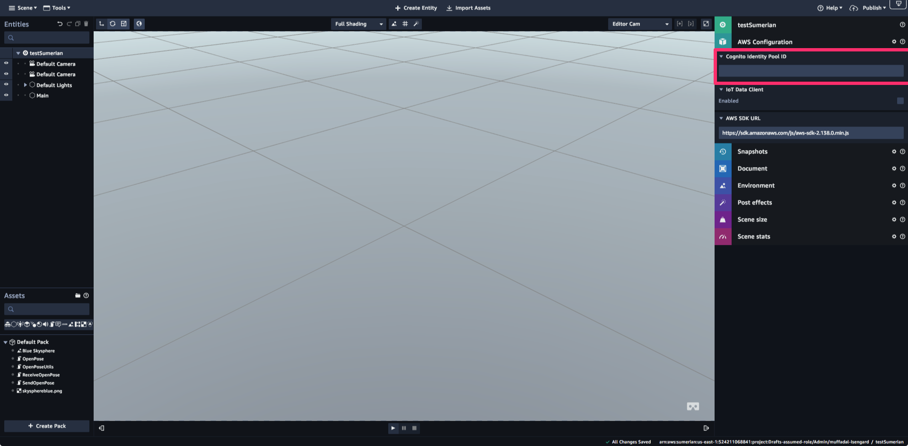
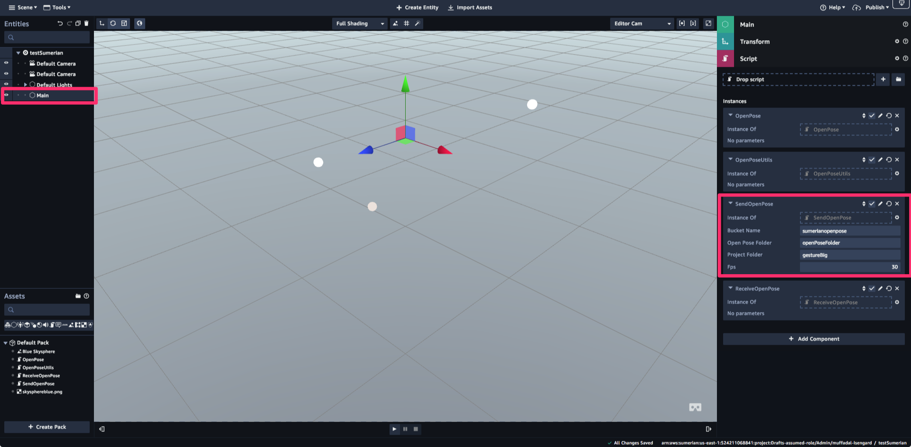

# Workshop - testing and viewing output
## 3.0 Configure Amazon Sumerian as the output 

### Intro
This workshop will use Amazon Sumerian to visualize the output from OpenPose. You will use some scripts that take the raw OpenPose output data and translate it to Sumerian coordinates. The result is that you can manipulate the model in Sumerian. 

### Amazon Cognito Identity Pool ID to use AWS resources
Create Amazon Cognito Identity Pool ID on the AWS Console using AWS CloudFormation. You can use the template in the *resources > cloudFormation* folder. See our [Amazon Cognito Setup Using AWS Cloudformation tutorial](https://docs.sumerian.amazonaws.com/tutorials/create/beginner/aws-setup/) for information on creating the CloudFormation stack. Copy the **CognitoIdentityPoolID** from the **Outputs** tab of the cloudformation console and save it to a text file. You will need it in the next step.

### Create a Sumerian Scene
Naviage to the AWS Sumerian service and create a new scene. Give your scene a name e.g. "testSumerianScene".

The Sumerian assets for this workshop have been pre-created for you. 

**Need Cristine's help to document what the assets have implemented e.g the 2 stick figures, a mapping of the openpose coordinates to the stick figure coodrinates etc.**

Click on the **Import Assets** tab on the top middle section of the screen. Next, click the Browse button or alternately drag and drop the assets that are located in the *resources > sumerian assets* folder of the workshop in the **Drop your file here...** section. 

Once the assets are imported, navigate to the panel on the right and click on the AWS Configuration tab and then paste the **Cognito Identity Pool ID** copied earlier in the textfield.

### Create an S3 bucket to host the Openpose json content
Setting up Openpose and translating a video stream into Openpose coordinates can take a long time. For this workshop, we have provided the Openpose generated json coordinates to you in the *resources > openpose* folder. In this section, we will:
1.  create an s3 bucket with the heirarchy that the Sumerian asset scripts expect

*Note: This assumes the following:*

 * you have access to an environment which as aws cli installed
 * You have a set of AWS credentials configured

`aws s3 mb s3://sumerianopenpose`
`aws s3api put-object --bucket sumerianopenpose --key openPoseFolder/gestureBig/`

2. update the CORS policy on the S3 bucket to ensure that the Sumerian project can read the bucket contents. 

Navigate to the AWS console > *sumerianopenpose* bucket > **Permisions** tab > **CORS configuration** . Copy the following CORS configuration to the bucket

`<?xml version="1.0" encoding="UTF-8"?>
<CORSConfiguration xmlns="http://s3.amazonaws.com/doc/2006-03-01/">
<CORSRule>
​    <AllowedOrigin>*</AllowedOrigin>
​    <AllowedMethod>GET</AllowedMethod>
​    <AllowedMethod>POST</AllowedMethod>
​    <AllowedMethod>PUT</AllowedMethod>
​    <AllowedMethod>DELETE</AllowedMethod>
​    <MaxAgeSeconds>3000</MaxAgeSeconds>
​    <AllowedHeader>*</AllowedHeader>
</CORSRule>
</CORSConfiguration>`

3. upload the contents to the s3 location 

`aws s3 cp <path to sumerian workshop folder>/resources/openpose/gestureBig s3://sumerianopenpose/openPoseFolder/gestureBig/ --recursive`

Confirm that the upload is successful, by clicking the gestureBig folder and verfying that the json files have been uploaded.

4.  Ensure that the sumeran project is pointing to the correct S3 location it expects the openPose files

Click the **Main** tab from the panel in the right side of the Sumerian console. Expand the **SendOpenPose** section and verify that the **Bucket Name**Open Pose Folder** and **Project Folder** field names are matching your S3 bucket heirarchy.

### Running the Scene in Sumerian

Click the play button and enjoy the dancign stick figure show :)

Note: If you cannot see the stick figures, you may need to adjust/zoom the Sumerian project's camera angle.

Optional: To create a public link of your sumerian hosted scene, you can click Publish>Create public link on the top right hand corner of the sumerian console. This will generate a public url for your scene.

### Extra Steps to deploy to production using a SBE
Deploying to a physical Snowball Edge 

* There are a few differences you need to be aware of when moving from our development branch which is all cloud based to a physical Snowball Edge device: Greengrass versions, cloud based Lambda functions vs SBE Lambda functions, single point of failure (SPOF)
* The Snowball Edge Ordering process