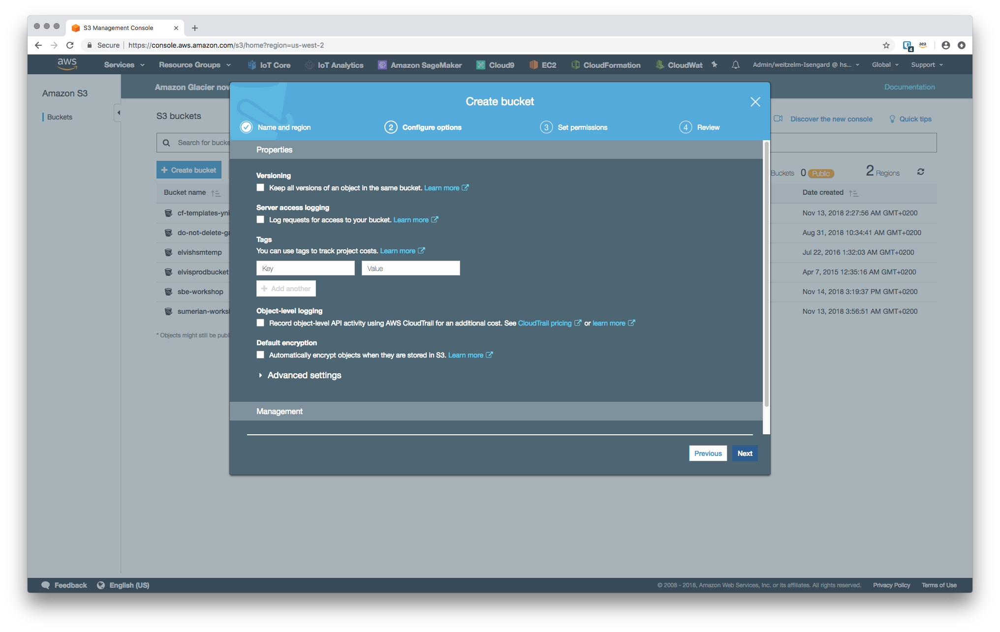
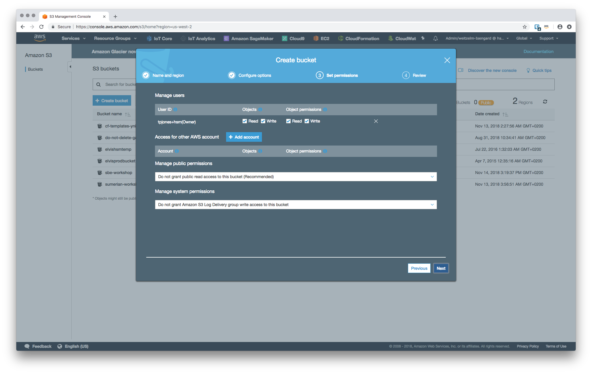
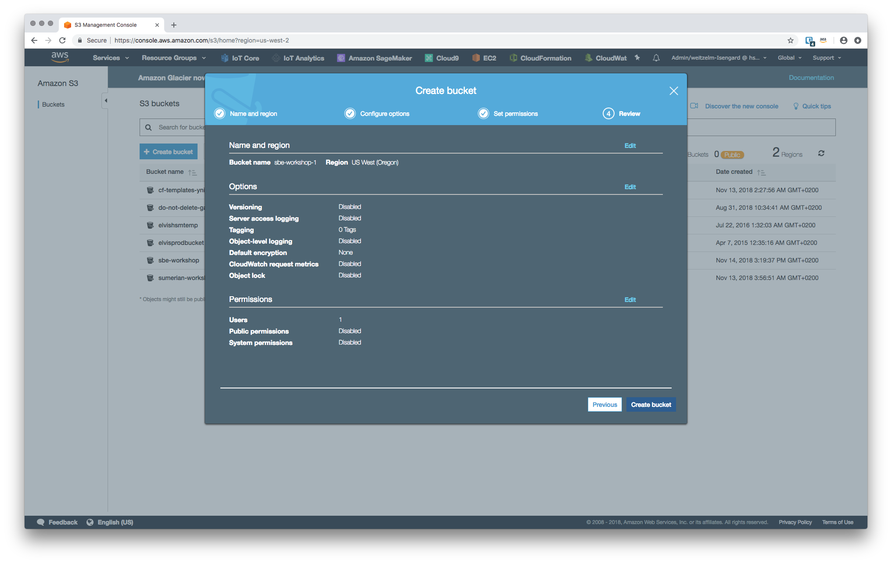

# Workshop - Module 4

## 1. Setting up S3 and EC2 folders

In order to emulate the filesystem on the *Snowball Edge* we will use *S3* in the cloud and the local filesystem on *EC2*.

### 1.1 *S3* bucket and folders

In the first instance we will use the AWS console to create an S3 bucket and two folders inside the bucket.

1. Bring up the *AWS* console in your browser and change to the *S3* service.

2. Create an S3 bucket and call it `sbeworkshop-` and append your shortname to it, e.g. `sbeworkshop-weitzelm`. Accept the default settings for the bucket settings.

	
	
	
	
	
3. Using the managment console navigate into the S3 bucket.

	
	
4. Inside the S3 bucket we can now create two folders. One will be used to upload files to, the second folder will receive the processed output available for download and use with downstream service, e.g. *Sumerian*. Select to **Create folder** in your new bucket and call it `upload`.

	
	
	
5. Select to **Create folder** in the same bucket and call it `download`.

	
	

### 1.2 *EC2* folders

We now need a folder on the EC2 instance's filesystem that we will download source video files into in order for a local process to process it. We create this folder in the `/tmp` sub-directory.

1. Connect to your *EC2* instance using `ssh`, e.g. using `ssh -i "~/Downloads/SBE_Workshop.pem" ec2-user@18.236.68.43`.

2. Change into the `tmp` directory using `cd /tmp`.

3. Create a new directory called `src` using the command `mkdir src`.

4. Chage into the newly created directory using `cd src`.

5. Create a new directory called `upload` using the command `mkdir upload`.

6. Create a new directory called `download` using the command `mkdir download`.

