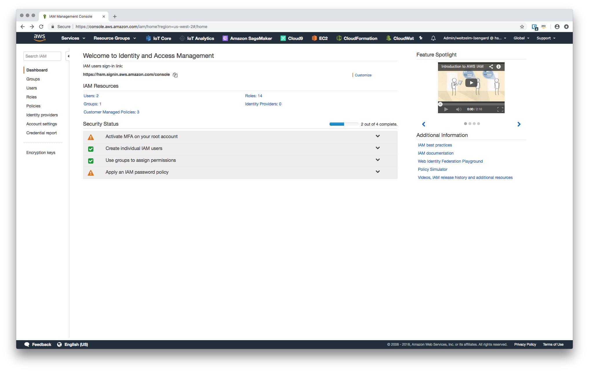
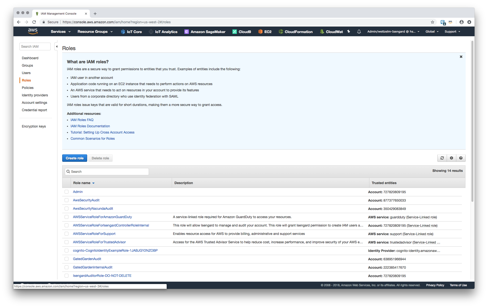
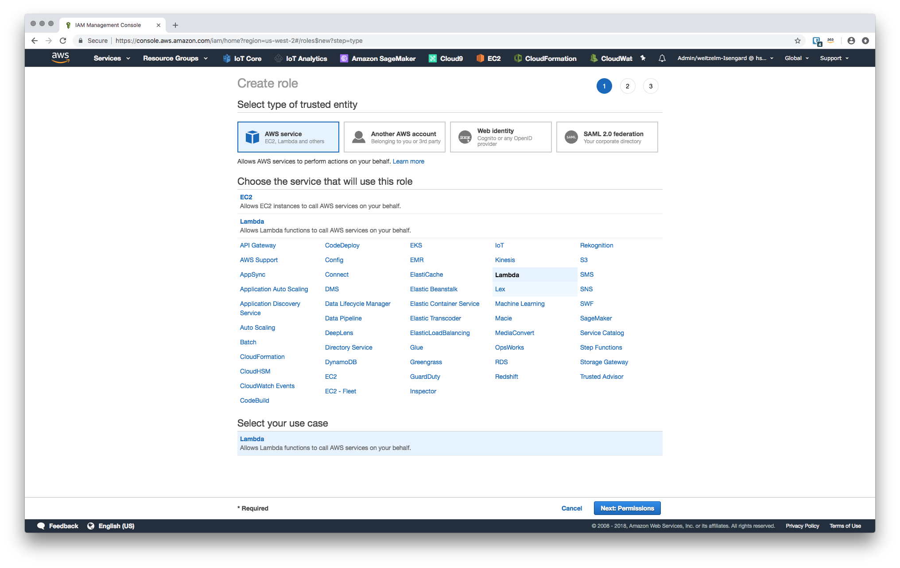
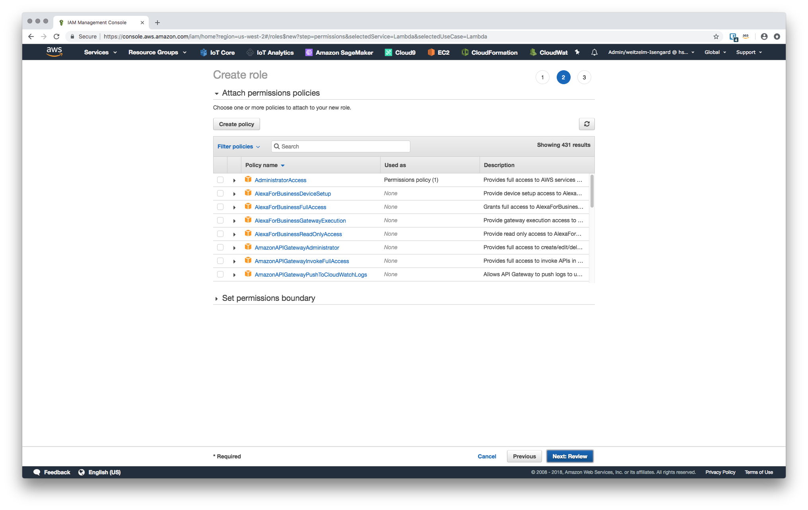
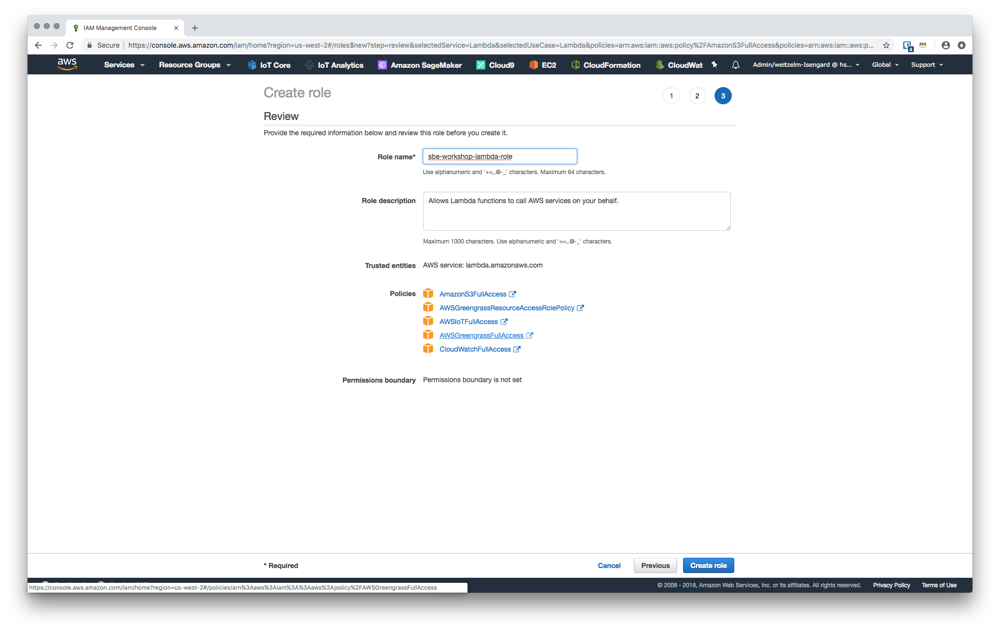
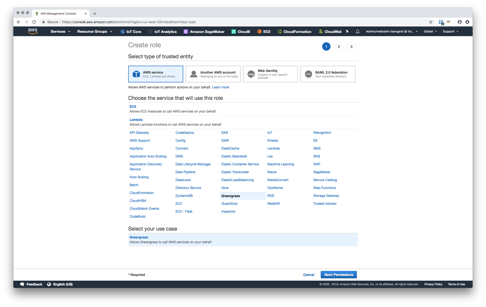
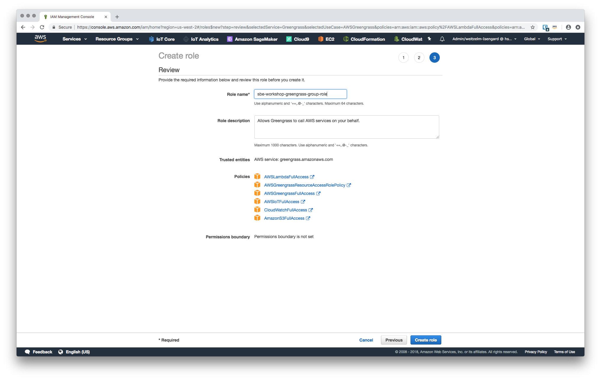

# Workshop - Module 6

## Permissions

In order to be able to have *Greengrass* and *Lambda* hosted functions interact with other parts of the AWS eco-system of services we need to ensure that the necessary permissions are made available through service roles for each of the services (i.e. for the *Greengrass* saervcie and for the *Lambda* service).

### 1.1 Create service role for use with *Lambda*

1. Bring up the AWS console in your browser and change to the *IAM* service.

	

2. Change to the *Roles* section and select to **Create role**.

	
	
3. Leave **AWS service** selected in the `Select type of trust entity` and select **Lambda** from the section `Choose the service that will use this role`.

	

4. Search for and assign the following list of policies to the new role:

	1. `AmazonS3FullAccess`
	2. `CloudWatchFullAccess`
	3. `AWSGreengrassResourceAccessRolePolicy`
	4. `AWSIoTFullAccess`
	5. `AWSGreengrassFullAccess`

	

5. Name the new role `sbe-workshop-lambda-role` and select to **Create role**.

	

### 1.2 Create service role for use with *Greengrass*

6. Create a another new role, this time we select **Greengrass** in the section `Choose the service that will use this role`.

	
	
7. Search for and assign the following list of policies to the new role:

	1. `AWSLambdaFullAcces`
	2. `AmazonS3FullAccess`
	2. `CloudWatchFullAccess`
	3. `AWSGreengrassResourceAccessRolePolicy`
	4. `AWSIoTFullAccess`
	5. `AWSGreengrassFullAccess`

	

8. Name the new role `sbe-workshop-greengrass-role` and select to **Create role**.
