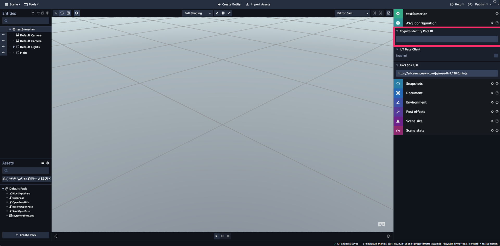
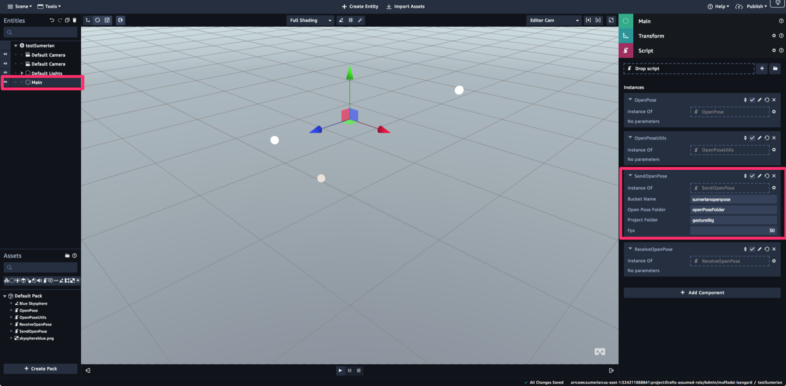

# Workshop - Module 09 testing and viewing output
## 1.0 Configure Amazon Sumerian as the output 

### 1.1 Intro
This workshop will use Amazon Sumerian to visualize the output from OpenPose. Sumerian will use three JavaScript scripts that take the raw OpenPose output data (JSON files) and translate it to Sumerian coordinates. The result is that you can manipulate the model in Sumerian. 

### 1.2 Amazon Cognito Identity Pool ID to use AWS resources
1. Create Amazon Cognito Identity Pool ID on the AWS Console using AWS CloudFormation. Copy the code below into an editor and save it as `sumerian.yml`

```
---
AWSTemplateFormatVersion : 2010-09-09
Description: Creates a Cognito Pool for the Amazon Sumerian Concierge Experience.
Outputs:
  CognitoIdentityPoolID:
    Description: The Cognito Identity Pool ID. Place this in the AWS settings of your Amazon Sumerian Scene
    Value:
      Ref: CognitoIdentityPool
Resources:
    CognitoIdentityPool:
        Type: AWS::Cognito::IdentityPool
        Properties:
          IdentityPoolName:
            Fn::Sub: "SumerianTutorialCognitoIdentityPool${AWS::StackName}"
          AllowUnauthenticatedIdentities: True
    CognitoIdentityExampleRole:
        Type: AWS::IAM::Role
        Properties:
          AssumeRolePolicyDocument:
            Version: '2012-10-17'
            Statement:
            - Action: sts:AssumeRoleWithWebIdentity
              Effect: Allow
              Principal:
                Federated: 'cognito-identity.amazonaws.com'
              Condition:
                StringEquals:
                  cognito-identity.amazonaws.com:aud:
                    Ref: CognitoIdentityPool
          ManagedPolicyArns:
          - arn:aws:iam::aws:policy/AmazonPollyReadOnlyAccess
          - arn:aws:iam::aws:policy/AmazonLexRunBotsOnly
          - arn:aws:iam::aws:policy/AmazonDynamoDBFullAccess
          - arn:aws:iam::aws:policy/AmazonS3FullAccess
          - arn:aws:iam::aws:policy/AmazonRekognitionReadOnlyAccess
    CognitoRoleAttachment:
      Type: "AWS::Cognito::IdentityPoolRoleAttachment"
      Properties:
        IdentityPoolId:
          Ref: CognitoIdentityPool
        Roles:
          unauthenticated:
            Fn::GetAtt: [CognitoIdentityExampleRole, Arn]
```

1. Connect to the AWS Management Console and navigate to the CloudFormation service. Use the `launch stack` button. Then choose the file you just created (sumerian.yml). Give your stack a name and click the **Create Stack** button.
**Note**: *For additional details, please see the [Amazon Cognito Setup Using AWS Cloudformation tutorial](https://docs.sumerian.amazonaws.com/tutorials/create/beginner/aws-setup/) for information on creating the CloudFormation stack and the use of Cognito.*

1. Once the stack has been sucessfuly deployed, copy the **CognitoIdentityPoolID** from the **Outputs** tab of the cloudformation console and save it to a text file. You will need it in the next step.

### 1.3 Create a Sumerian Scene
1. Use the AWS Management Console to naviage to the AWS Sumerian service and create a new scene. Give your scene a name e.g. "SBEoutput".

1. The Sumerian JavaScript assets for this workshop have been pre-created for you and have been bundled into a .zip file. Download the file here: <mark>URL GOES HERE</mark>

1. Click on the **Import Assets** tab on the top middle section of the screen. Next, either click the `Browse` button or **drag and drop** the zip file you just downloaded into the **Drop your file here...** section of Sumerian. 

1. Once the assets are imported, navigate to the panel on the right and click on the AWS Configuration tab and then paste the **Cognito Identity Pool ID** copied earlier in the textfield.




<mark> REWRITE ALL OF THIS !!!!!!!!!!</mark>

### 1.4 Create an S3 bucket to host the Openpose JSON content
Since we were not able to setup individual OpenPose instances for everyone in the workshop, we have created a s3 bucket with example output files. This will allow you to test that Sumerian is correctly translating a video stream into OpenPose coordinates. 

1. Download the OpenPose JSON output coordinate files

*Note: you can eiter use the AWS Management Console to make these buckets or the Cloud9 IDE for these steps. Here we will describe the Cloud9 steps:*

`aws s3 mb s3://sumerianopenpose`
`aws s3api put-object --bucket sumerianopenpose --key openPoseFolder/gestureBig/`

2. update the CORS policy on the S3 bucket to ensure that the Sumerian project can read the bucket contents. 

Navigate to the AWS console > *sumerianopenpose* bucket > **Permisions** tab > **CORS configuration** . Copy the following CORS configuration to the bucket

```
<?xml version="1.0" encoding="UTF-8"?>
<CORSConfiguration xmlns="http://s3.amazonaws.com/doc/2006-03-01/">
<CORSRule>
​    <AllowedOrigin>*</AllowedOrigin>
​    <AllowedMethod>GET</AllowedMethod>
​    <AllowedMethod>POST</AllowedMethod>
​    <AllowedMethod>PUT</AllowedMethod>
​    <AllowedMethod>DELETE</AllowedMethod>
​    <MaxAgeSeconds>3000</MaxAgeSeconds>
​    <AllowedHeader>*</AllowedHeader>
</CORSRule>
</CORSConfiguration>
```

3. upload the contents to the s3 location 

`aws s3 cp <path to sumerian workshop folder>/resources/openpose/gestureBig s3://sumerianopenpose/openPoseFolder/gestureBig/ --recursive`

Confirm that the upload is successful, by clicking the gestureBig folder and verfying that the json files have been uploaded.

4.  Ensure that the sumeran project is pointing to the correct S3 location it expects the openPose files

Click the **Main** tab from the panel in the right side of the Sumerian console. Expand the **SendOpenPose** section and verify that the `Bucket Name`, `OpenPose Folder`, and `Project Folder` field names match your S3 bucket heirarchy.



### 1.5 Running the Scene in Sumerian

Click the play button and enjoy the dancign stick figure show :)

Note: If you cannot see the stick figures, you may need to adjust/zoom the Sumerian project's camera angle.

Optional: To create a public link of your sumerian hosted scene, you can click `Publish`, then `Create public link` on the top right hand corner of the sumerian console. This will generate a public url for your scene.

