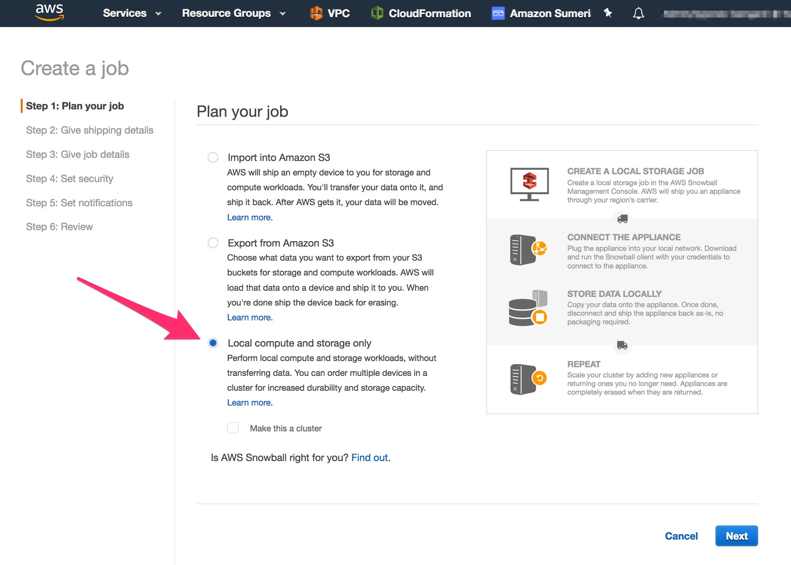
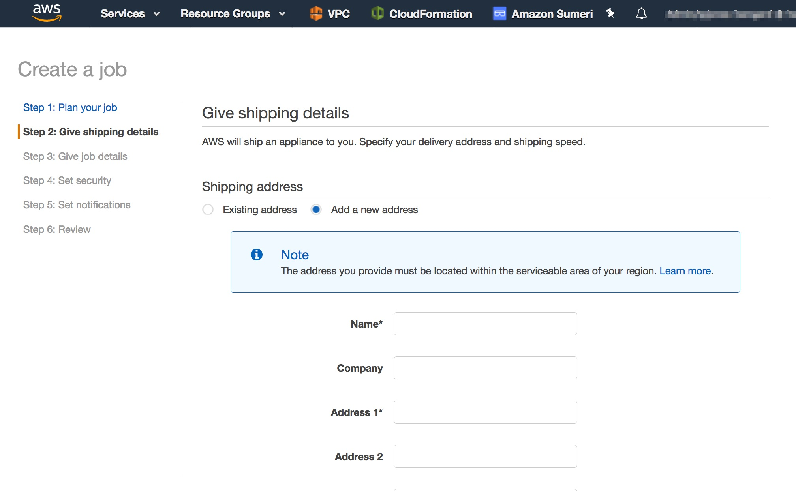

# Workshop - 10 beyond the workshop

## Extra Steps to deploy to production using a SBE

### 10.1 The Snowball Edge Ordering process

1. Create a job

1. Shipping address

### 10.2 Deploying to a physical Snowball Edge 

* There are a few differences you need to be aware of when moving from our development branch which is all cloud based to a physical Snowball Edge device: Greengrass versions, cloud based Lambda functions vs SBE Lambda functions, single point of failure (SPOF)
