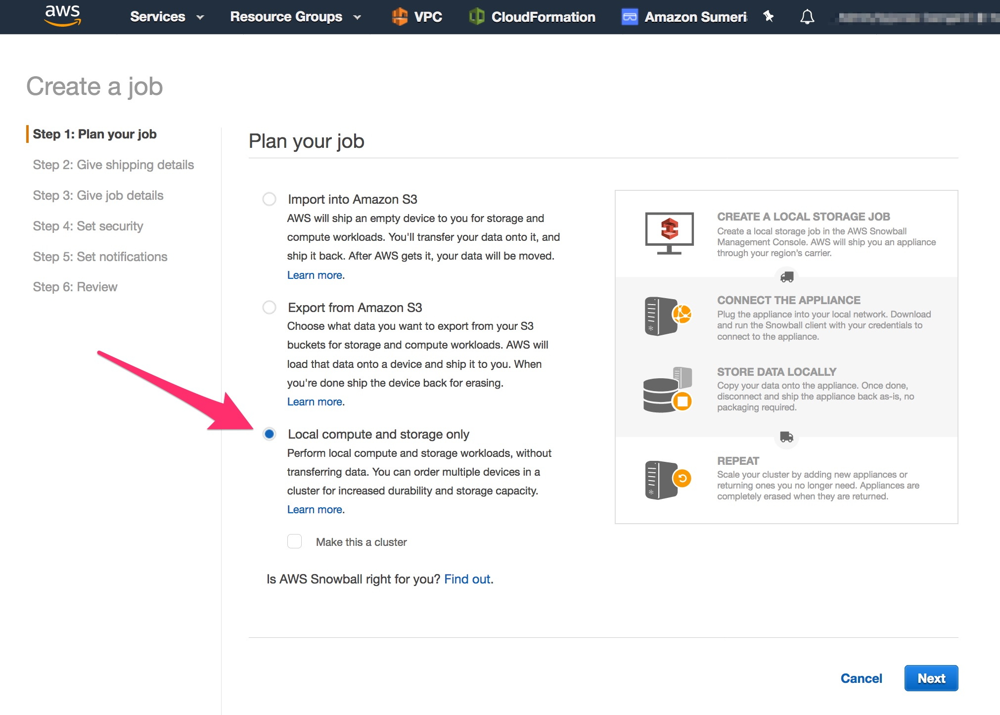
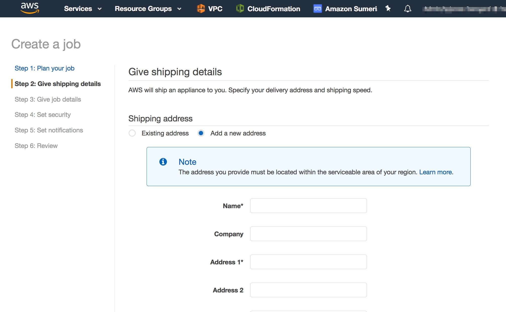

# Workshop - 10 beyond the workshop

## Extra Steps to deploy to a SnowBall Edge device

NOTE: **This is informational only** - so that you are able to understand the process of working with a physical SnowBall device. You will not be able to order a SnowBall device in the workshop.

### 10.1 The Snowball Edge Ordering process

1. Use the AWS Management Console to connect to the SnowBall service and choose the  **Create job** button, then select **Local compute and storage only**

1. Input your shipping address

### 10.2 Deploying to a physical Snowball Edge 

There are a few differences you need to be aware of when moving from our development branch which is all cloud based to a physical SnowBall Edge device:

-  There may be different versions of Greengrass that are supported in the cloud vs on the edge
-  In the workshop we created Lambda functions in both AWS Lambda and in Greengrass
-  Clustering for scale
-  Updating the AMI 
